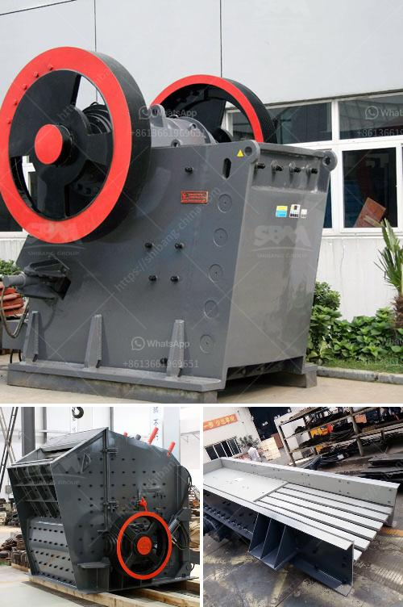

<h3>ball mill cement plant</h3>
A ball mill is a type of grinder used to grind materials into extremely fine powder for use in mineral dressing processes, paints, pyrotechnics, ceramics, and selective laser sintering. The ball mill is a key piece of equipment for grinding crushed materials, and it is widely used in production lines for powders such as cement, silicates, refractory material, fertilizer, glass ceramics, etc. as well as for ore dressing of both ferrous and non-ferrous metals.

The ball mill can grind various ores and other materials either wet or dry. There are two kinds of ball mill, grate type and overfall type due to different ways of discharging material. There are many kinds of ball mill lining plates in the market, including high manganese steel, ultra-high manganese steel, alloy steel, rubber, and magnetic lining plates. These ball mill liners are the most important wear parts for cement production plants.

The overall industrial efficiency of the ball mill process in cement plants is low in comparison to other types of machinery like rotary kilns. The energy consumption of the ball mill accounts for about 10% of the total energy consumption of the cement plant. Therefore, the efficiency improvement of the ball mill process is crucial for energy conservation and emission reduction of the cement manufacturing plant.

To improve the efficiency of the ball mill grinding process, a research collaboration between the cement plant and a university was initiated. A typical ball mill features a cylindrical shell rotating about its axis, and usually has a maximum capacity of around 10-20 tons of material per hour. The grinding media used in the ball mill is typically steel balls.

To improve the grinding process, the balls are graded according to their size and placed in the mill with the mixture of raw materials. As the ball mill rotates, the steel balls in it collide with the raw material particles, and as a result, break them into smaller pieces. This process continues until the desired fineness is achieved.

Several factors were identified during the research collaboration that affect the efficiency of the ball mill process in cement plants. These factors include the loading capacity of the mill, the diameter of the steel balls, and the speed of rotation of the mill. By optimizing these factors, it was possible to improve the grinding efficiency of the ball mill by about 15%.

To further enhance the efficiency of the ball mill process, the researchers recommended employing a closed-circuit grinding system. In this system, the coarse particles of the ground material are removed before being fed back into the mill for further grinding. This prevents the accumulation of large particles, which would otherwise reduce the grinding efficiency.

In conclusion, the ball mill is a key piece of equipment in cement plants for grinding raw materials into fine powders. Improving the efficiency of the ball mill process can result in significant energy conservation and emission reduction. By optimizing the loading capacity, the size of the steel balls, and the rotation speed of the mill, it is possible to enhance the grinding efficiency and overall industrial performance of the cement plant. The development and implementation of these improvements can contribute to a sustainable and greener future for the cement industry.
<h3>Contact us</h3><ul><li><strong>Whatsapp:&nbsp;<a href="https://wa.me/8613661969651">+8613661969651</a></strong></li><li><a href="https://swt.shibang-china.com/?git&amp;zhl&amp;ball mill cement plant"><strong>Online Service(chat now)</strong></a></li></ul><h3>Related</h3><ul><li><a href='ball grinding machine in india.md'>ball grinding machine in india</a></li><li><a href='barytes pulverizer mill for sale india.md'>barytes pulverizer mill for sale india</a></li><li><a href='micro powder grinding mill prices.md'>micro powder grinding mill prices</a></li><li><a href='philippine crushing machine.md'>philippine crushing machine</a></li><li><a href='feldspar powder machine.md'>feldspar powder machine</a></li></ul>