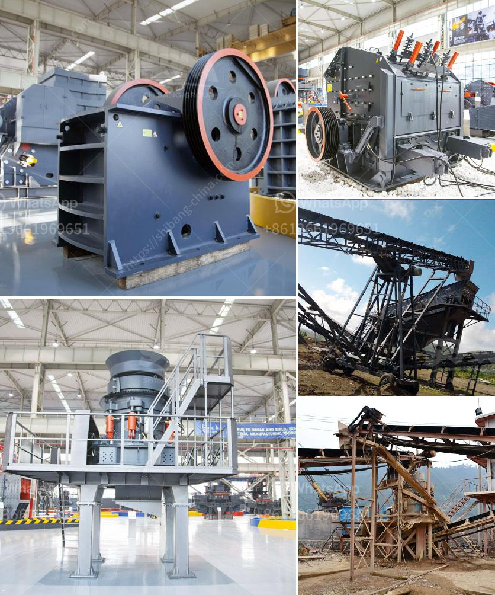

<h3>ball mill china making</h3>
The ball mill is a key piece of equipment for grinding crushed materials, and it is widely used in production lines for powders such as cement, silicates, refractory material, fertilizer, glass ceramics, etc. as well as for ore dressing of both ferrous and non-ferrous metals.

The ball mill can grind various ores and other materials either wet or dry. There are two kinds of ball mills, grate type and overfall type due to different ways of discharging material.

China ball mill is made up of feeding part, discharging part, gyre part, transmission part (reducer, small transmission gear, motor, and electrical controller) and so on. The hollow axis of china ball mill adopts the cast steel, and the lining can be replaced. The big rotary gear is forged from cast rolling gears.

Ball mill, China ball mill, ball mill for sale, ball mill manufacturer, ball mill supplier have fuller knowledge of the ball mill structure. Besides, it can offer the related services such as production flow scheme, equipment manufacturing, installation instructions, spare parts supply and production line operation.

Our company specializes in producing ball mill, ball mill technology, ball mill principle, and various types of ball mill products, welcome everyone to visit the factory.

Large-sized ball mill is scientifically designed. The hollowness of the shaft can be used to replace the system components, and so on. The rollers can be adjusted conveniently, and the hollowness of the rollers ensures the successful storage of materials. Every part has been considered to establish a better cooperation between the user and the system.

China ball mill market is expected to grow at a modest rate due to increases in industrial output, coupled with growing demand for metal and non-metal products. In addition, huge implementation of ball mill across various sectors such as electronics, healthcare, and automotive has fueled the demand for ball mills.

Overall, China ball mill market is anticipated to grow significantly due to changing consumer preferences, availability of skilled labor, and recent advancements in technology. However, factors such as high initial costs and technological challenges may hamper the market growth over the forecast period.
<h3>Contact us</h3><ul><li><strong>Whatsapp:&nbsp;<a href="https://wa.me/8613661969651">+8613661969651</a></strong></li><li><a href="https://swt.shibang-china.com/?git&amp;zhl&amp;ball mill china making"><strong>Online Service(chat now)</strong></a></li></ul><h3>Related</h3><ul><li><a href='crusher stone prices.md'>crusher stone prices</a></li><li><a href='crusher plants for sale.md'>crusher plants for sale</a></li><li><a href='used crushing quarry plant in south africa.md'>used crushing quarry plant in south africa</a></li><li><a href='grinding machine kuwait for sale.md'>grinding machine kuwait for sale</a></li><li><a href='how to make a iron ore crusher machine.md'>how to make a iron ore crusher machine</a></li></ul>