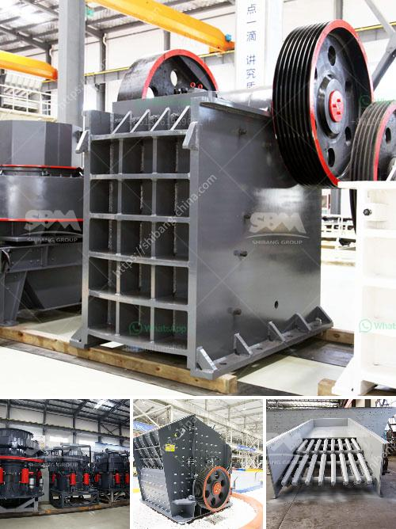

<h3>ball mill design calculation</h3>
Ball mill design calculations are a crucial part of the process that needs to be performed to ensure that you achieve the optimal design for your mill. Here are a few steps to help you do that.

First, you need to calculate the static charge volume in the mill by measuring the mill's internal dimensions and taking into account the material density, ball density, and mill operating conditions. This static charge volume can have a significant impact on the grinding efficiency and mill behavior.

Next, you need to determine the critical speed of the mill. The critical speed is the speed at which the centrifugal force is equal to the gravitational force of the grinding balls, so the grinding balls will not fall from the mill's shell. The critical speed is typically calculated using the formula:

Where Nc is the critical speed in revolutions per minute, D is the mill's diameter in meters, and d is the mill's effective length in meters.

Once you have determined the critical speed, you can calculate the rotational speed in revolutions per minute (RPM) at which the mill should operate. This speed is usually chosen to be about 70-80% of the critical speed for best grinding efficiency.

Next, you need to determine the optimal ball size to maximize the grinding efficiency. The ball size should be such that it strikes the material and breaks it efficiently, without being too large or too small. The optimal ball size can be calculated using the Bond's equation:

Where dB is the ball diameter in meters, Kd is a constant depending on the material being ground (typically around 350 for most ores), F is the feed size (80% passing size) in micrometers, and D and d are the mill dimensions in meters.

Finally, you need to determine the power requirements for your mill. The power consumption is the most critical factor affecting the grinding efficiency. The power can be calculated using the Bond's equation:

Where P is the power consumption in kilowatts, G is the net grinding power required in kilowatts, J is the fraction of the mill's volume occupied by the grinding media, and Rr is the internal radius of the mill in meters.

By following these steps and performing the necessary calculations, you can design a ball mill that achieves the optimal grinding efficiency for your specific application. However, it should be noted that these calculations are based on certain assumptions and simplifications, and the actual mill performance may vary. Therefore, it is always advisable to conduct experimental tests to validate the design calculations and optimize the mill operation.
<h3>Contact us</h3><ul><li><strong>Whatsapp:&nbsp;<a href="https://wa.me/8613661969651">+8613661969651</a></strong></li><li><a href="https://swt.shibang-china.com/?git&amp;zhl&amp;ball mill design calculation"><strong>Online Service(chat now)</strong></a></li></ul><h3>Related</h3><ul><li><a href='sample of granite quarry proposal.md'>sample of granite quarry proposal</a></li><li><a href='450 tph limestone crusher.md'>450 tph limestone crusher</a></li><li><a href='crusher plant made in pakistan price.md'>crusher plant made in pakistan price</a></li><li><a href='raymond mill and high pressure difference.md'>raymond mill and high pressure difference</a></li><li><a href='crusher pew jaw crusher.md'>crusher pew jaw crusher</a></li></ul>