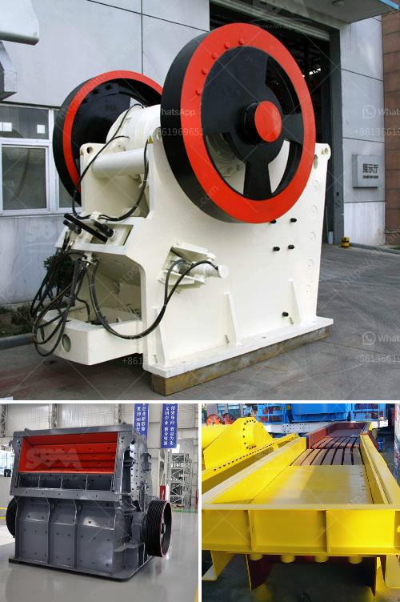

<h3>ball mill for grinding metal</h3>
The ball mill is a key piece of equipment for grinding crushed materials, and it is widely used in production lines for powders such as cement, silicates, refractory material, fertilizer, glass ceramics, etc. As well as for ore dressing of both ferrous and non-ferrous metals. The ball mill can grind various ores and other materials either wet or dry. There are two kinds of ball mill, grate type and overfall type, due to different ways of discharging material.

A ball mill consists of a hollow cylindrical shell rotating about its axis. The axis of the shell may be either horizontal or at a small angle to the horizontal. It is partially filled with balls. The grinding media are the balls, which may be made of steel (chrome steel), stainless steel, ceramic, or rubber. The inner surface of the cylindrical shell is usually lined with an abrasion-resistant material such as manganese steel or rubber. Less wear takes place in rubber lined mills. The length of the mill is approximately equal to its diameter.

The grinding media are loaded into the mill alongside the feed material; it can be done dry or wet. The grinding action is induced by relative motion between the balls and the feed material driven by the rotating shell. The feed material can be grinded as result of falling impact and autogenous grinding of the balls as the material in the mill is ground to a desired particle size.

Ball mills are commonly used for crushing and grinding the materials into an extremely fine form. The ball mill contains a hollow cylindrical shell that rotates about its axis. This cylinder is filled with balls that are made of stainless steel or rubber to the material contained in it. Ball mills are classified as attritor, horizontal, planetary, high energy, or shaker.

The ball mill is an efficient grinding tool, which is capable of grinding various types of material into fine powder. The ball mill crushes and grinds many kinds of ores and rocks during mining. It is also used for mine selection. Ball mills are widely used in the mining industry, construction industry and chemical industry.

The grinding medium in the ball mill can be divided into steel balls, steel bars, gravels, and mineral balls, etc. Meanwhile, these medium poses various functions that fulfill a variety of grinding tasks. Some media make the grinding process even more efficient by allowing a higher material flow rate, while some perform the opposite function by interrupting the material flow. The main factors affecting grinding efficiency are the properties and nature of the ore as well as the operating conditions of the ball mill.

In conclusion, ball mills are essential machinery that are used extensively in the metal grinding industry. They are used for various purposes, including grinding ores, creating fine powder, and mixing substances. The versatile nature of ball mills allows for quick and effective grinding capabilities. It is critical to choose the right ball mill for the particular needs of your metal grinding operation.
<h3>Contact us</h3><ul><li><strong>Whatsapp:&nbsp;<a href="https://wa.me/8613661969651">+8613661969651</a></strong></li><li><a href="https://swt.shibang-china.com/?git&amp;zhl&amp;ball mill for grinding metal"><strong>Online Service(chat now)</strong></a></li></ul><h3>Related</h3><ul><li><a href='calcium carbonate for ball mill.md'>calcium carbonate for ball mill</a></li><li><a href='design calculation in jaw crusher.md'>design calculation in jaw crusher</a></li><li><a href='feldspar ball mills feldspar ball mills manufacturers.md'>feldspar ball mills feldspar ball mills manufacturers</a></li><li><a href='diamond river mining equipment in china.md'>diamond river mining equipment in china</a></li><li><a href='kenya jaw crusher is manufactured.md'>kenya jaw crusher is manufactured</a></li></ul>