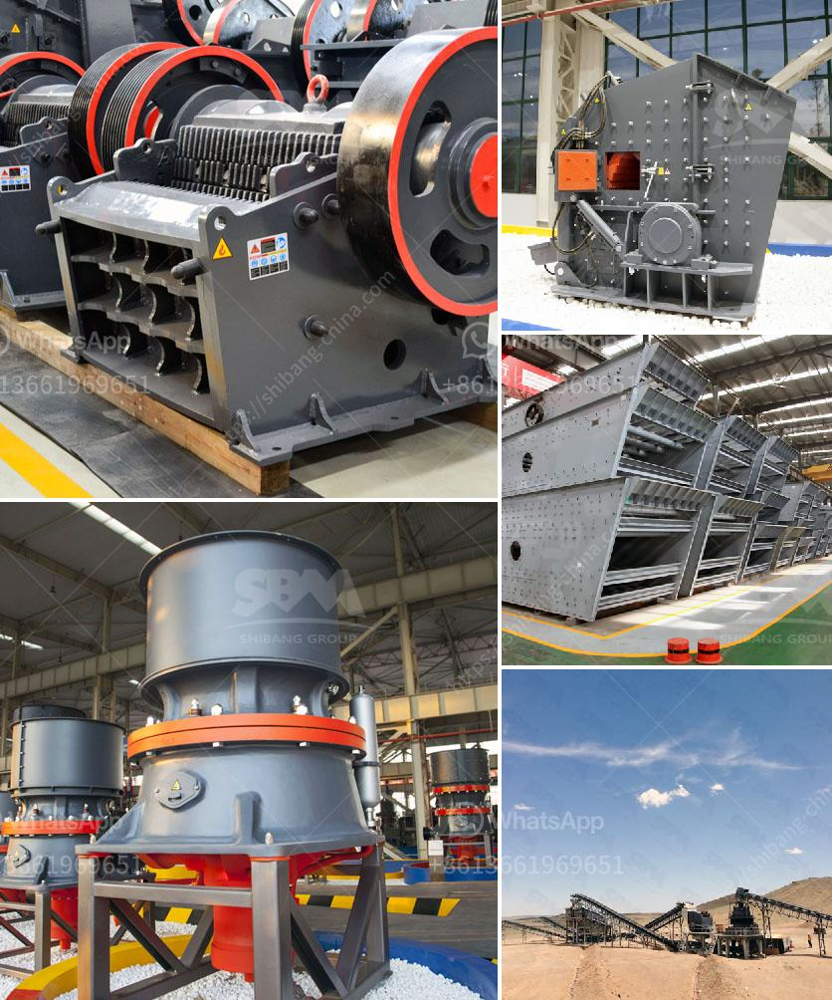

<h3>ball mill for silica grinding made in japan</h3>
The ball mill for silica grinding made in Japan is widely used in cement, silicate products, new building materials, refractory materials, chemical fertilizers, black and non-ferrous metal beneficiation, glass ceramics and other production industries. It is an essential equipment in the production line for silica grinding.

The ball mill is mainly composed of a cylinder body, inlet and outlet end covers, a main bearing, grinding media, and a motor. The cylinder body is the main working part of the ball mill, and the grinding media is the grinding material used for grinding silica.

The grinding media of the ball mill for silica grinding made in Japan is gradually decreasing in diameter and increasing in length. To ensure the quality of grinding, it is necessary to choose the appropriate grinding media. The grinding media can be made of porcelain, stainless steel, corundum, tungsten carbide, and other materials.

The ball mill for silica grinding made in Japan has various functions, such as crushing, grinding, and dispersion. It can be used in the production of various materials, such as new building materials, chemical fertilizers, metal beneficiation, glass ceramics, and so on. With the continuous improvement of technology, the grinding efficiency of the ball mill has been greatly improved, and the maintenance and operation are more convenient.

In summary, the ball mill for silica grinding made in Japan is an essential equipment for the production line of silica grinding. It has various functions and is widely used in various industries. With the continuous development of technology and the improvement of grinding efficiency, the ball mill will surely bring greater benefits to the production industry.
<h3>Contact us</h3><ul><li><strong>Whatsapp:&nbsp;<a href="https://wa.me/8613661969651">+8613661969651</a></strong></li><li><a href="https://swt.shibang-china.com/?git&amp;zhl&amp;ball mill for silica grinding made in japan"><strong>Online Service(chat now)</strong></a></li></ul><h3>Related</h3><ul><li><a href='roll crusher for various size coal.md'>roll crusher for various size coal</a></li><li><a href='gold refining equipment machine plant.md'>gold refining equipment machine plant</a></li><li><a href='limestone price in pakistan.md'>limestone price in pakistan</a></li><li><a href='crushing plants in malaysia.md'>crushing plants in malaysia</a></li><li><a href='stone quarry business proposal.md'>stone quarry business proposal</a></li></ul>