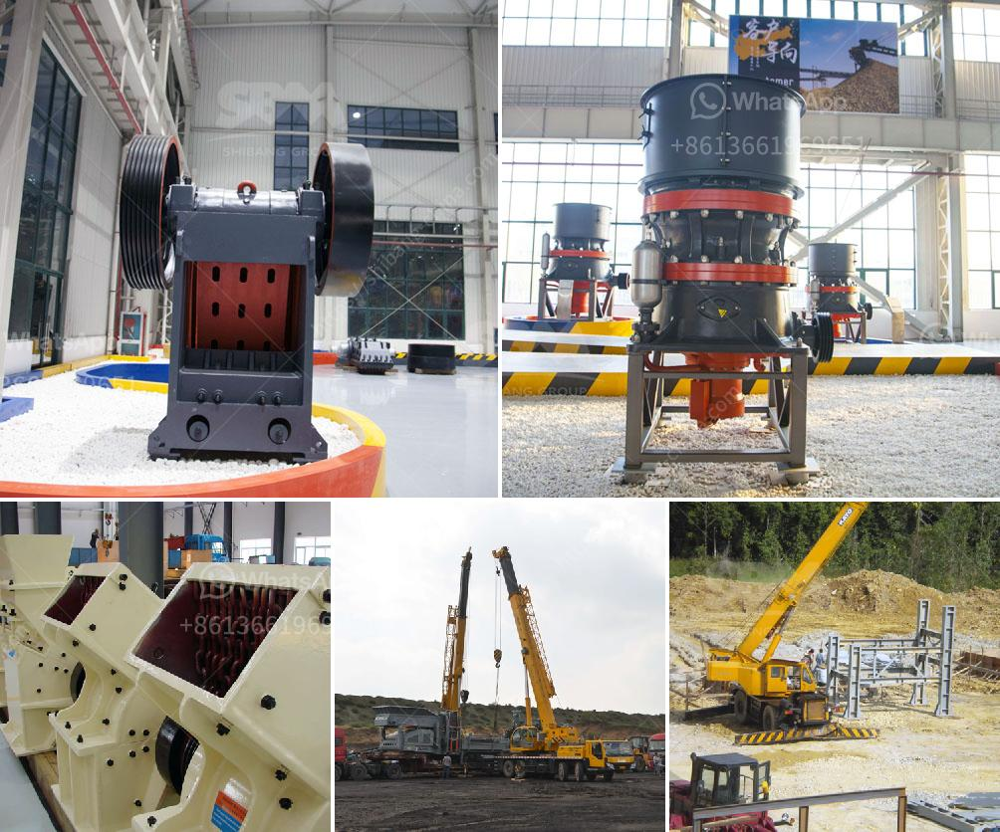

<h3>ball mill forge price</h3>
Ball mills are widely used in the production of cement, silicate products, new building materials, refractory materials, fertilizers, black and non-ferrous metal dressings, and glass ceramics. They are used for dry or wet grinding of various ores and other grindable materials. With the continuous advancement of technology and the improvement of industrial automation, the price of ball mills has become an important consideration for buyers.

The price of a ball mill forge is determined by various factors, including the equipment's quality, model, technology, and manufacturer. Different manufacturers have different production methods, scales, and equipment procurement channels, which will directly affect the price of the ball mill forge.

Firstly, the quality of the ball mill forge is an essential factor in determining its price. Higher quality ball mills are usually made of better materials, have excellent workmanship, and undergo strict quality control. Such ball mills have longer service life, higher grinding efficiency, and lower maintenance costs, making them a more cost-effective option in the long run.

Secondly, the model and specifications of the ball mill forge will affect its price. Generally, larger models with higher production capacity and more advanced technology are priced higher than smaller ones. The specific production requirements of users should be considered when selecting the appropriate model to ensure that the ball mill forge can meet their production needs.

Thirdly, the technology and innovation level of the manufacturer also play a crucial role in determining the price of a ball mill forge. Manufacturers with strong technological capabilities, research and development capabilities, and continuous innovation can produce more advanced and efficient equipment. However, these advanced technologies often come with a higher price tag.

Lastly, the procurement channel of the manufacturer will also influence the price of the ball mill forge. Manufacturers that have established long-term and stable cooperative relationships with raw material suppliers can often obtain better prices for materials, thereby reducing production costs. These cost advantages can be reflected in the final price of the equipment.

In conclusion, the price of a ball mill forge is influenced by various factors, including the quality of the equipment, its model and specifications, the manufacturer's technology level, and the procurement channels. When purchasing a ball mill forge, it is crucial to consider these factors comprehensively and select a cost-effective option based on the specific production requirements and budget. It is always recommended to conduct thorough research, compare different manufacturers, and negotiate to obtain the best price and quality combination for a ball mill forge.
<h3>Contact us</h3><ul><li><strong>Whatsapp:&nbsp;<a href="https://wa.me/8613661969651">+8613661969651</a></strong></li><li><a href="https://swt.shibang-china.com/?git&amp;zhl&amp;ball mill forge price"><strong>Online Service(chat now)</strong></a></li></ul><h3>Related</h3><ul><li><a href='used equipment cement for sale vertical roller mills.md'>used equipment cement for sale vertical roller mills</a></li><li><a href='vertical grinding mill machine in china.md'>vertical grinding mill machine in china</a></li><li><a href='crusher machine china.md'>crusher machine china</a></li><li><a href='roller mill cement price.md'>roller mill cement price</a></li><li><a href='quarry machine manfacturer.md'>quarry machine manfacturer</a></li></ul>