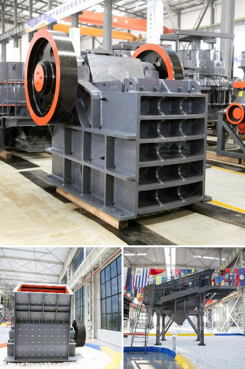

<h3>ball mill heat balance</h3>
Ball mill heat balance is an important aspect of engineering analysis and design of a cement grinding system. In cement production, thermal energy accounts for about 20-30% of the total energy consumption of the process. Hence, it is important to optimize the efficiency of the cement grinding system.

- The first method, we know the ventilation of the mill + the cement temperature and we want to calculate the water quantity we need to inject in order to get the temperature at mill outlet we would like to have.

- The second method, we know the ventilation inside the mill + the quantity of water injected and we calculate the temperature of the cement at mill outlet.

In this article, we will focus on the first method of heat balance calculation for a ball mill and discuss the importance of optimizing the heat transfer in the system.

- The grinding heat (q_grinding), which represents the heat dissipated by the material during grinding.

- The sensible heat (q_sensible), which represents the heat absorbed or released by the material without changing its phase.

- The latent heat (q_latent), which represents the heat absorbed or released by the material during a phase change, such as the evaporation of water.

The heat balance calculation is based on the principle that the total heat absorbed by the material within the mill should be equal to the total heat lost from the mill.

To achieve this balance, the cooling air flow rate and water injection rate should be adjusted accordingly.

The cooling air temperature should be optimized to control the average temperature of the material inside the mill. Excessive cooling air can result in a decrease in the grinding efficiency, while insufficient cooling air can lead to thermal overload of the mill.

The water injection rate should be adjusted to maintain the desired mill outlet temperature. Excessive water injection can cause an increase in the mill outlet temperature, while insufficient water injection can lead to a decrease in the mill outlet temperature.

By optimizing the heat transfer in the ball mill system, the grinding efficiency can be improved, leading to energy savings and reduced operating costs.

In conclusion, the heat balance of a ball mill is an important aspect of engineering analysis and design of a cement grinding system. Optimizing the heat transfer in the system will contribute to an efficient grinding process and overall energy savings in the process. Proper adjustment of the cooling air flow rate and water injection rate is crucial to maintain the desired mill outlet temperature.
<h3>Contact us</h3><ul><li><strong>Whatsapp:&nbsp;<a href="https://wa.me/8613661969651">+8613661969651</a></strong></li><li><a href="https://swt.shibang-china.com/?git&amp;zhl&amp;ball mill heat balance"><strong>Online Service(chat now)</strong></a></li></ul><h3>Related</h3><ul><li><a href='marble processing plant.md'>marble processing plant</a></li><li><a href='vibrating screening machine.md'>vibrating screening machine</a></li><li><a href='roll mill machine.md'>roll mill machine</a></li><li><a href='portable cone crusher plant.md'>portable cone crusher plant</a></li><li><a href='crusher machine from south philippines.md'>crusher machine from south philippines</a></li></ul>