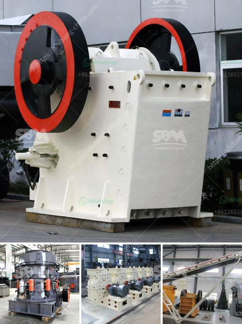

<h3>ball mill in malaysia</h3>
The ball mill is a key equipment for grinding materials, widely used in powder-making production line such as cement, silicate sand, new-type building material, refractory material, fertilizer, ore dressing of ferrous metal and non-ferrous metal, glass ceramics, etc. Ball mill can grind various ores and materials with dry type or wet type. There are two kinds of ball mills, grate type and overfall type due to different ways of discharging material.

One of the most commonly used ball mills is the planetary ball mill. It consists of several small steel balls that rotate around their axis inside the cylindrical shell of the mill. Optimized rotating speed and milling time ensures a uniform product fineness and hence improves the efficiency of the milling process. The planetary ball mill can be used for rapid grinding of materials to ultra-fine powder size.

In Malaysia, ball mills are used to grind various kinds of ores and other materials, especially for grinding calcium carbonate, gypsum, limestone, feldspar, kaolin, clinker, dolomite, phosphate ore, iron ore, and other materials. This article will introduce the characteristics and uses of the ball mill in Malaysia.

The ball mill in Malaysia is manufactured using high-quality materials, precise engineering techniques, and state-of-the-art machinery to ensure the efficient grinding process. The ball mill is designed for grinding limestone, gypsum, and other materials that contain a similar abrasiveness or grindability level. The capacity of the ball mill is determined by the desired throughput and fineness of the product, as well as the type of grinding operation.

Ball mills can be divided into two types: wet ball mill and dry ball mill. In wet grinding, the material is mixed with water or other liquids to form a slurry and the desired particle size is achieved by the impact and attrition forces between grinding media (balls) within the rotating mill. Dry grinding is used in many applications where the final product needs to be powder or fine size. In this case, grinding media (balls) will directly impact and break the materials.

The ball mill in Malaysia is operated with a set of parameters that determine the desired particle size of the final product. These parameters include the speed of rotation, size of the mill, and the size of the grinding media. Grinding media are located in a mill jar that is filled with media and the raw material to be ground. The mill jar is rotated at a fixed speed, causing the media and the raw material to collide and impact each other, resulting in the desired particle size reduction.

In conclusion, the ball mill in Malaysia plays an important role in the comminution of various minerals and materials. It is widely used in the cement, silicate product, new building materials, refractory materials, fertilizer, black and non-ferrous metal processing and glass ceramics production industry. With the advantages of high grinding efficiency, low power consumption, simple structure, and easy maintenance, the ball mill is an indispensable equipment in the mining and manufacturing industry in Malaysia.
<h3>Contact us</h3><ul><li><strong>Whatsapp:&nbsp;<a href="https://wa.me/8613661969651">+8613661969651</a></strong></li><li><a href="https://swt.shibang-china.com/?git&amp;zhl&amp;ball mill in malaysia"><strong>Online Service(chat now)</strong></a></li></ul><h3>Related</h3><ul><li><a href='ulltra fine grinding mill.md'>ulltra fine grinding mill</a></li><li><a href='india gypsum powder equipment.md'>india gypsum powder equipment</a></li><li><a href='list of machinery used in cement plant.md'>list of machinery used in cement plant</a></li><li><a href='portable sand grinding machine.md'>portable sand grinding machine</a></li><li><a href='limestone jaw crushers.md'>limestone jaw crushers</a></li></ul>