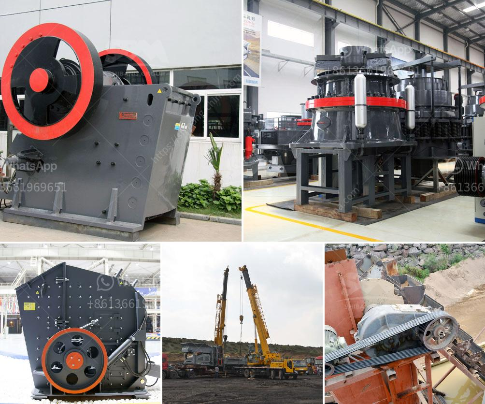

<h3>ball mill in zimbabwe for sale</h3>
Ball mill, a type of grinder, is a cylindrical device used in grinding (or mixing) materials like ores, chemicals, ceramic raw materials, and paints. The ball mills are the key milling equipment after material has been crushed. It is divided into two rubbing ways: the dry and the wet. Ball mill is mainly composed of charging and discharging, cyclone and rotation parts.

With the booming economy and development of mining industry, ball mill in Zimbabwe has been increasingly popular in recent years. So, Zimbabwe, a large market for ball mill, is basically considered to be a starting point for South African businessmen as a stepping stone to enter the international market.

For those small entrepreneurs who want to invest in mining and mineral processing, it is essential to buy ball mill in Zimbabwe for sale. It is a good investment to choose this equipment because it can provide sand or rock that is needed for pavement and other construction purposes. By obtaining the required size, the ball mill can further process materials and generate more economic value.

The ball mill in Zimbabwe for sale is mainly used for mining, cement, coal, refractory materials and other industries in general, it has a wide range of industrial applications. After being processed by the ball mill, it can be used as an indispensable raw material in the industrial field. Zimbabwe's economic development is crucial, and the ball mill plays a key role in the process of mining.

Overall, buying ball mill in Zimbabwe for sale is a great investment with benefits that can be reaped swiftly. With the potential to transform the country's economy through mining and mineral processing, there is no doubt that Zimbabwe's ball mill market is set to grow exponentially in the coming years, attracting both local and international investors.
<h3>Contact us</h3><ul><li><strong>Whatsapp:&nbsp;<a href="https://wa.me/8613661969651">+8613661969651</a></strong></li><li><a href="https://swt.shibang-china.com/?git&amp;zhl&amp;ball mill in zimbabwe for sale"><strong>Online Service(chat now)</strong></a></li></ul><h3>Related</h3><ul><li><a href='hammer mill sales kenya.md'>hammer mill sales kenya</a></li><li><a href='ball mill design calculation.md'>ball mill design calculation</a></li><li><a href='working cone crushers.md'>working cone crushers</a></li><li><a href='concrete crushing machines.md'>concrete crushing machines</a></li><li><a href='price list coal crushing plant.md'>price list coal crushing plant</a></li></ul>