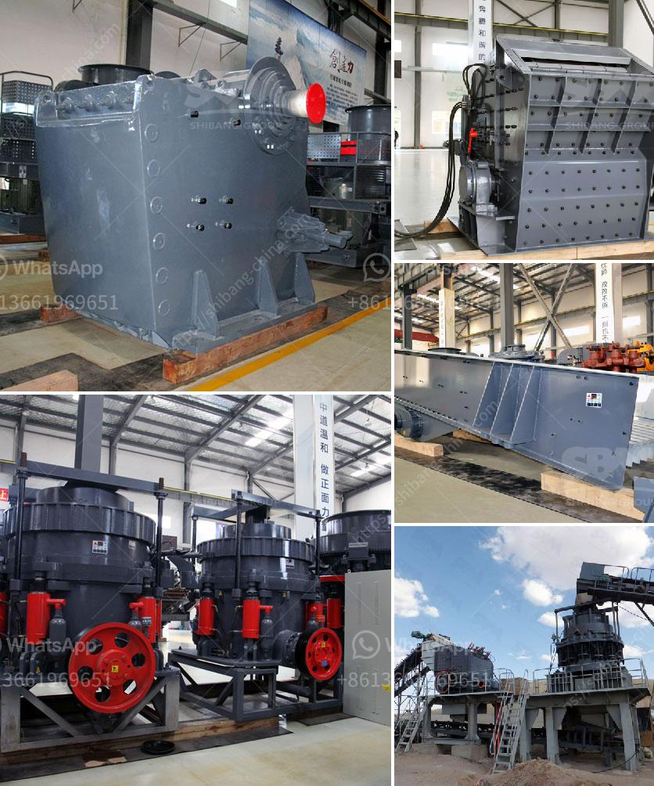

<h3>ball mill manufacturer in india</h3>
Ball mills are a fundamental part of the manufacturing industry in the USA as well as around the world. Ball mills crush material into various sizes and extract resources from mined materials. Pebble mills are a type of ball mill and are also used to reduce the size of hard materials, down to 1 micron or less.

Because of their fairly simple design, ball mills and pebble mills are less likely to need costly repairs than other crushing equipment. However, both types of mills need maintenance. Generally, speaking, ball mill maintenance allows for the periodic replacement of liners inside the mill, as they wear down over time.

Certain types of ball mills feature a hollow cylinder and rotate around a horizontal axis, partially filled with the material to be ground plus the grinding medium. Different materials are used as media, including ceramic balls, flint pebbles, and stainless steel balls. An internal cascading effect reduces the material to a fine powder.

India is one of the leading producers of various industrial minerals in the world. These minerals are vital for the manufacturing industry, enhancing production, and offering a competitive edge over competitors. To cater to the country's growing needs, several ball mill manufacturers in India have mushroomed across various cities.

One of the prominent ball mill manufacturers in India, Techno Designs, offers superior quality and innovative machinery for the mining and mineral processing industries. With years of experience in this field, Techno Designs has a well-established infrastructure, equipped with advanced manufacturing machinery and tools.

Located in Gujarat, Techno Designs is known for offering a range of ball mill machinery that is precisely engineered to meet industry-specific needs. The company's engineers and technicians work closely with clients to understand their requirements, ensuring that the machinery is tailored to their specifications. 

Techno Designs' ball mills are known for their simple operation and low maintenance requirements. These mills are manufactured using high-quality materials and components, ensuring long-lasting performance and durability. The company also offers customized equipment and machinery, allowing clients to have a ball mill that perfectly fits their needs.

Another renowned ball mill manufacturer in India, ELECON, offers a range of machinery with supreme features. The company's mills are known for their excellent performance and durability. ELECON's mills are manufactured using advanced technology and high-quality materials, making them suitable for various industries.

ELECON's ball mills are used in several industries, including mining, fertilizer production, chemical processing, and cement production. The company's mills provide efficient grinding solutions, ensuring high productivity and smooth operations. Additionally, ELECON offers excellent after-sales support to ensure the seamless operation of their mills.

In conclusion, ball mills are essential equipment in the manufacturing industry, playing a vital role in reducing the size of materials and extracting valuable resources. Several ball mill manufacturers in India provide top-notch machinery for various industries. Companies like Techno Designs and ELECON have earned a reputation for manufacturing high-quality ball mills, offering customized solutions and excellent after-sales support. These manufacturers are contributing to India's growth and development by providing efficient equipment to boost productivity in various sectors.
<h3>Contact us</h3><ul><li><strong>Whatsapp:&nbsp;<a href="https://wa.me/8613661969651">+8613661969651</a></strong></li><li><a href="https://swt.shibang-china.com/?git&amp;zhl&amp;ball mill manufacturer in india"><strong>Online Service(chat now)</strong></a></li></ul><h3>Related</h3><ul><li><a href='clay ceromic manufacturing process.md'>clay ceromic manufacturing process</a></li><li><a href='pe series jaw crusher rate 1000ton per hour.md'>pe series jaw crusher rate 1000ton per hour</a></li><li><a href='limestone hammer mill process.md'>limestone hammer mill process</a></li><li><a href='stone crusher equipment quarry.md'>stone crusher equipment quarry</a></li><li><a href='lime stone crushing plant india.md'>lime stone crushing plant india</a></li></ul>