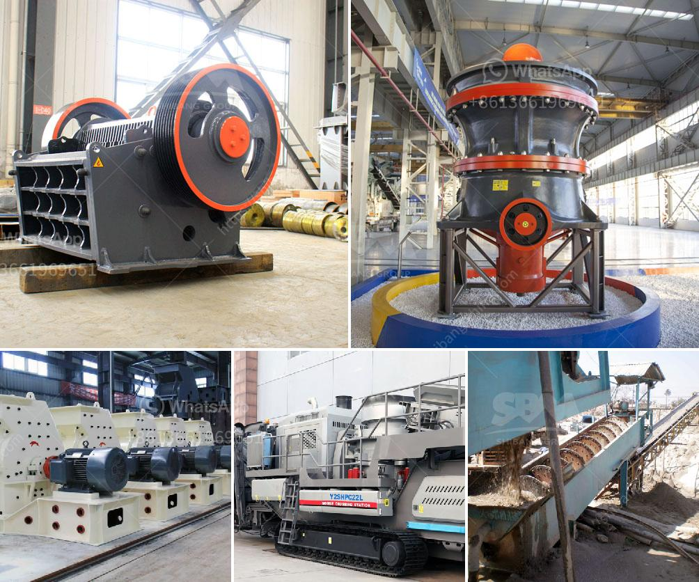

<h3>ball mill pictures</h3>
Ball mill pictures can be found all over the internet and in several magazines and journals. Ball mill manufacturers and users must comply with relevant safety regulations and guidelines to ensure the safety of their employees and operators. Ball mill pictures showcase the immense power and capacity these machines have, as well as their ability to grind materials finely.

A ball mill is a cylindrical machine that rotates around a horizontal axis. Its shell is filled with grinding media, such as steel or ceramic balls, that crush the material to a fine powder. As the drum rotates, the balls are lifted and then cascade downward, grinding the material in the process.

Ball mill pictures reveal the dynamic process taking place inside the mill. They capture the stunningly violent collision of the grinding media with the materials, resulting in the reduction of particle size. With each rotation, the balls advance further into the drum, subjecting the material to repeated impact and attrition forces.

Ball mill pictures can help potential buyers and users understand the energy efficiency of this machine. The grinding media's high kinetic energy enables the reduction of particle size with minimal heat generation. This makes ball mills ideal for grinding temperature-sensitive materials, such as organic chemicals or explosives.

These pictures also demonstrate the versatility of ball mills. They can be used for both dry and wet grinding applications, making them suitable for a range of industries, including ceramics, paint, cement, and minerals processing. Furthermore, ball mills can be operated in a batch or continuous mode, depending on the specific requirements of the application.

In conclusion, ball mill pictures provide a visual depiction of the grinding process inside these powerful machines. They showcase the impressive machinery and are helpful in educating potential buyers and users about the features and capabilities of ball mills. Whether it is the violent collisions between the grinding media and the material or the energy efficiency on display, these pictures highlight the functionality and versatility of ball mills.
<h3>Contact us</h3><ul><li><strong>Whatsapp:&nbsp;<a href="https://wa.me/8613661969651">+8613661969651</a></strong></li><li><a href="https://swt.shibang-china.com/?git&amp;zhl&amp;ball mill pictures"><strong>Online Service(chat now)</strong></a></li></ul><h3>Related</h3><ul><li><a href='portable hand powered rock crushers zambia.md'>portable hand powered rock crushers zambia</a></li><li><a href='new mobile and fixed rock crushing plant.md'>new mobile and fixed rock crushing plant</a></li><li><a href='quarry crusher for sale.md'>quarry crusher for sale</a></li><li><a href='grinder rock crusher.md'>grinder rock crusher</a></li><li><a href='kenya jaw crusher is manufactured.md'>kenya jaw crusher is manufactured</a></li></ul>