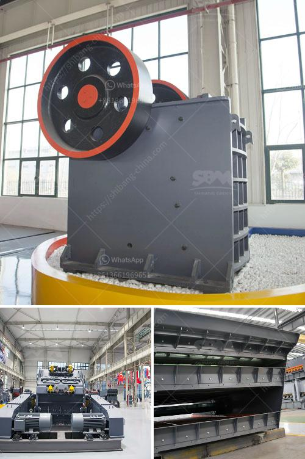

<h3>ball mill prices and for sale ghana</h3>
Ball mill is an important equipment in grinding process after primary crushing. It is extensively applied in cement, silicate products, new construction material, refractory material, chemical fertilizer, ferrous and non-ferrous metals beneficiation and glass ceramics industries. SBM Company offers quality ball mill prices and for sale in Ghana, which is suitable for grinding materials with various hardness.

The ball mill is a horizontal cylindrical rotating device, with outer gears transmission, two warehouses and a grate ball mill. The materials get into the first warehouse through the feeding quill shaft from the feeding device evenly and spirally. In the warehouse, there are ladder liners or ripple liners and different sizes of steel balls. When the cylinder rotates, the centrifugal force produced causes the steel balls to impact and grind the materials in the ball mill.

There are many factors that can influence the ball mill prices and for sale in Ghana, such as the choice of manufacturers, equipment type and model, the buyer's personal financial situation, production requirements and other factors. For this reason, SBM Company offers the most competitive prices, helping customers to build a low-cost, high-efficient crushing plant.

In Ghana, the size of 1/4-1/2”, 1/2-3/4”, 3/4-1” are more popular and the price are more expensive than other sizes. The mill can process other ores such as limestone, slag, gypsum, fly ash and so on. These ores can be ground into suitable particle size for beneficiation. Through the optimization of the roller, meanwhile, the ball mill prices and for sale ghana can work more efficiently.

“enterprise competition is not only the competition between enterprises, but also the competition of the whole industry chain.” Therefore, the ball mill prices and for sale ghana must be reasonable and a tendency to market their prices in order to reverse the price situation in the market and achieve the investment return.

It is understood that, SBM Company's newly developed coal mill products are mainly MB5X Pendulum Suspension Grinding Mill, T130X Superfine Grinding Mill, MW Series Micro Powder Mill and other models. In addition to the advantages mentioned above, there are many other unique advantages. For example, the equipment adopts sealed gear transmission system, which effectively prolongs the service life of the gear; the electrical system adopts centralized control, which greatly reduces the labor intensity of operators; and the grinding roller can be turned out for easy maintenance, and the grinding roller sleeve can be turned upside down, which can be repeated Use, to extend the service life.

In conclusion, in Ghana, the ball mill is widely used in powder-making production line including cement, silicate, new-type building material, refractory material, fertilizer, ore dressing of ferrous metal and non-ferrous metal, glass ceramics, etc. For more information on the ball mill prices and for sale in Ghana, you can contact our online mining engineers, who will offer professional suggestions and solutions for your mining business.
<h3>Contact us</h3><ul><li><strong>Whatsapp:&nbsp;<a href="https://wa.me/8613661969651">+8613661969651</a></strong></li><li><a href="https://swt.shibang-china.com/?git&amp;zhl&amp;ball mill prices and for sale ghana"><strong>Online Service(chat now)</strong></a></li></ul><h3>Related</h3><ul><li><a href='working cone crushers.md'>working cone crushers</a></li><li><a href='rock pulverizer crusher technologies.md'>rock pulverizer crusher technologies</a></li><li><a href='italy rotary cement packing machine.md'>italy rotary cement packing machine</a></li><li><a href='how much does it cost per day to run a gold mine.md'>how much does it cost per day to run a gold mine</a></li><li><a href='philippines second hand stone crusher.md'>philippines second hand stone crusher</a></li></ul>