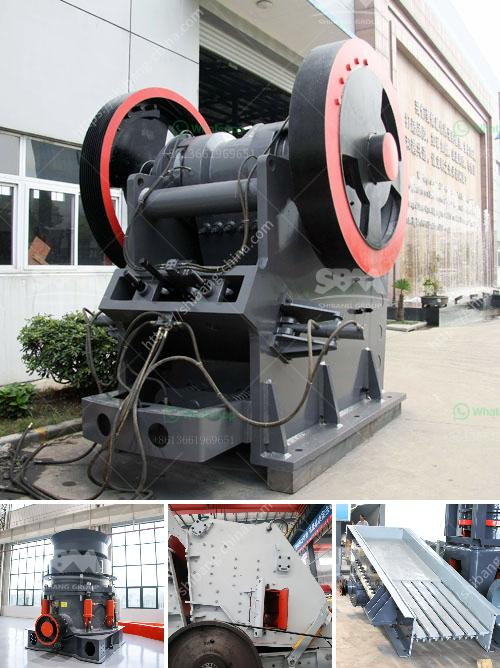

<h3>ball mill problems in copper plant</h3>
The ball mill is the key equipment for grinding materials after crushing, which is widely used in the manufacturing industries such as cement, silicate, new building materials, refractory materials, fertilizers, ferrous metals, nonferrous metals, glass ceramics, and others. It can grind various ores and other grindable materials in dry or wet conditions.

However, there are some problems that operators may encounter when using the ball mill. In this article, we mainly introduce several common problems and solutions in the ball mill operation.

The causes of overvibration in the ball mill are mainly the insufficient rigidity of the main bearing pedestal and the hollow shaft or the bearing damage. Therefore, it is required to equip the ball mill with a reinforced anti-vibration device.

In the operation of ball mills, the vibration of the pinion bearing should be controlled within a reasonable range. If the vibration exceeds the specified range, the machine should be shut down for maintenance to check and eliminate the fault.

In most cases, the ball mill grinding media requirements do not need to be excessively supplemented. In addition, some problems may arise due to the too small or too large load of grinding media. It is required that the loading ore should be reasonable, and the filling rate of grinding media should be adjusted in real-time according to the wear of grinding media.

The ball mill due to the long-term operation, the grinding media may become worn out, so how to reduce the worn phenomenon is the problem that most concerned by many enterprises. In order to reduce the manufacturing costs for cement, it is very important to optimize the existing mill installations as far as the grinding process is concerned and also to use high quality spare parts and consumables like grinding media.

Ball mills are predominantly used machines for grinding in the cement industry. Although ball mills have been used for more than one hundred years, the design is still being improved in order to reduce the grinding costs.

Cemex® can offer uncomplicated and reliable solutions with the installation of fully adapted grinding units to the requirements of the animal feed, mineral and agricultural industries.

Contrarily, if the grinding balls are too small to grind the material, the energy consumption will increase significantly. So, determining the correct grinding ball size is crucial to the success of a grinding operation.

In summary, problems in the operation of ball mills are mainly manifested in three aspects: grinding concentration, grinding particle size, and grinding energy consumption. We hope that through the above technical parameters, we can understand how to uniformly feed the grinding media of the ball mill. Hope you have a good command of the installation and operation of the ball mill after reading this article.
<h3>Contact us</h3><ul><li><strong>Whatsapp:&nbsp;<a href="https://wa.me/8613661969651">+8613661969651</a></strong></li><li><a href="https://swt.shibang-china.com/?git&amp;zhl&amp;ball mill problems in copper plant"><strong>Online Service(chat now)</strong></a></li></ul><h3>Related</h3><ul><li><a href='price kenya crushers.md'>price kenya crushers</a></li><li><a href='200 ton mini cement plant project cost in india.md'>200 ton mini cement plant project cost in india</a></li><li><a href='price of conveyor belt 6 meters.md'>price of conveyor belt 6 meters</a></li><li><a href='mobile crusher unit.md'>mobile crusher unit</a></li><li><a href='small scale gypsum powder production line.md'>small scale gypsum powder production line</a></li></ul>