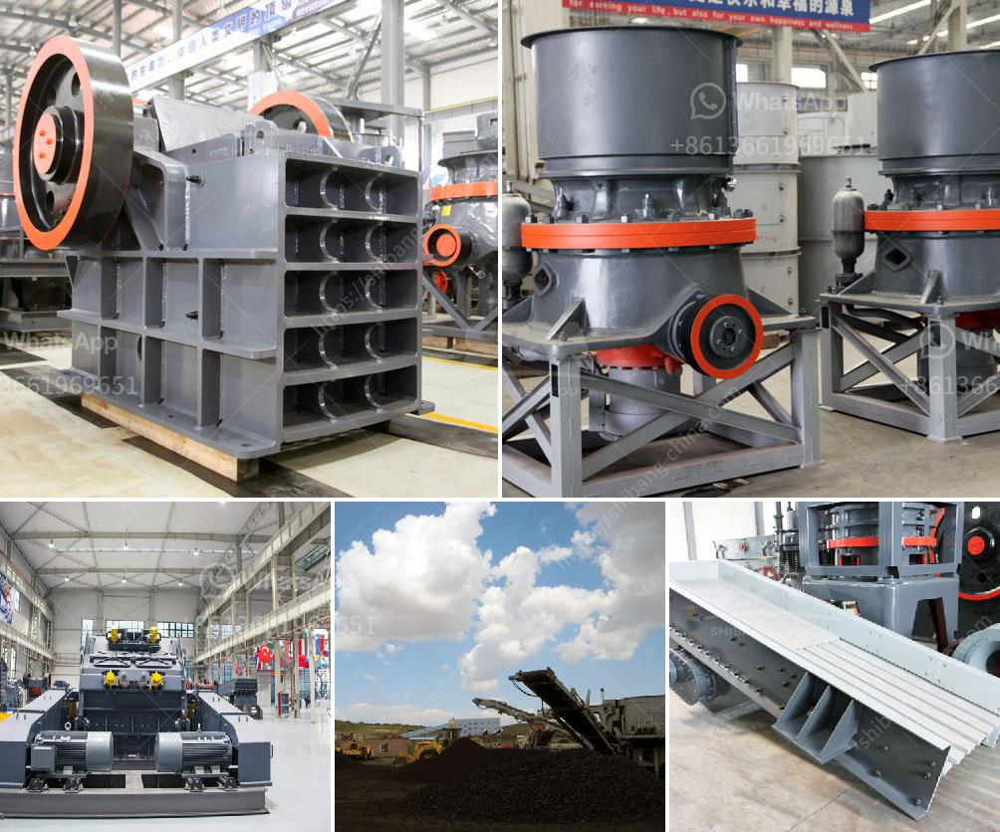

<h3>ball mill size</h3>
The ball mill is a key equipment in the mining industry for grinding various materials. It plays a vital role in the production line and is widely used in the production of cement, silicate, refractory materials, fertilizers, metal ores, glass ceramics, etc.

Choosing the right size of ball mills is essential for optimizing the effectiveness of the grinding process and ensuring efficient production. The size of a ball mill is measured in terms of its diameter and the length of its cylinder. The larger the diameter, the slower the rotation, and the smaller the particle size achieved. On the other hand, the length of the cylinder determines the retention time and hence the amount of grinding that can be achieved.

When it comes to selecting the appropriate ball mill size for the application, it is important to consider the feed size, desired product size, capacity requirements, and operating conditions. A smaller ball mill is suitable for finer grinding and allows for better control of the particle size distribution. On the other hand, a larger ball mill is required for coarse grinding and is typically used in primary milling applications.

In general, ball mills ranging from 100-300 tons per hour capacity are suitable for industrial-scale operations. The main advantage of the ball mill size is its adaptability for fluctuating process conditions. By adjusting the feed rate, the grinding ball size, and the residence time in the mill, operators can control the product size, while optimizing the grinding efficiency.

In conclusion, selecting the appropriate ball mill size is crucial for optimizing the grinding process in various industries. The feed size, desired product size, capacity requirements, and operating conditions should all be considered when determining the right size of a ball mill. By doing so, one can ensure efficient production, improved particle size distribution, and overall cost-effectiveness.
<h3>Contact us</h3><ul><li><strong>Whatsapp:&nbsp;<a href="https://wa.me/8613661969651">+8613661969651</a></strong></li><li><a href="https://swt.shibang-china.com/?git&amp;zhl&amp;ball mill size"><strong>Online Service(chat now)</strong></a></li></ul><h3>Related</h3><ul><li><a href='mobile mineral processing gravity plants.md'>mobile mineral processing gravity plants</a></li><li><a href='consol glass recycling price list south africa.md'>consol glass recycling price list south africa</a></li><li><a href='granite crushing plant in sri lanka.md'>granite crushing plant in sri lanka</a></li><li><a href='cost of a stone crusher.md'>cost of a stone crusher</a></li><li><a href='price of mobile stone crusher.md'>price of mobile stone crusher</a></li></ul>