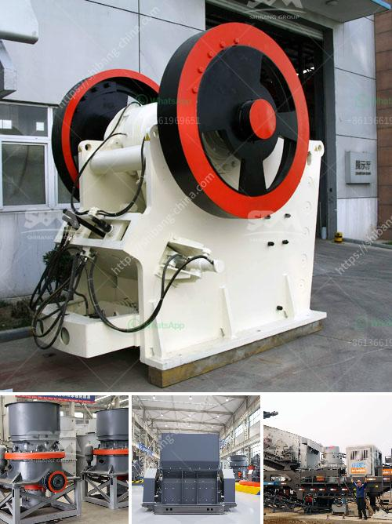

<h3>ball mill steel balls suppliers in kerala</h3>
In the mining industry, ball mills are used to grind material into a fine powder, enabling efficient extraction of minerals. Ball mills are widely utilized in the process of preparing materials for further processing in various industries such as construction, ceramics, metallurgy, and coal industries. Steel balls of different sizes are used as grinding media in ball mills, particularly in the mining industry. As the demand for ball mill steel balls is increasing, suppliers are making efforts to produce high-quality products.

There are many ball mill steel balls suppliers in Kerala, but finding a reliable supplier can be challenging. To fulfill the needs of customers, various specifications of steel balls are produced by many companies. These suppliers focus on meeting the diverse needs of different industries by producing balls with different diameters, hardness levels, and other critical properties.

The steel balls used in ball mills are typically made of carbon or alloy steel. High-quality steel balls have the advantages of high hardness, good wear resistance, and high impact resistance. These properties ensure the efficient grinding of materials in ball mills, resulting in optimal performance and lower energy consumption.

While choosing a ball mill steel balls supplier in Kerala, it is essential to consider certain factors. Firstly, the supplier should have a good reputation and a track record of supplying high-quality products. Secondly, they should provide a wide range of steel balls with different specifications to cater to various industry needs. Additionally, timely delivery and excellent customer service are crucial factors to consider.

Some suppliers go the extra mile by offering customized solutions to meet specific requirements of their customers. They not only provide steel balls but also grinding rods, forging balls, and other related products, catering to diverse grinding needs.

In conclusion, ball mill steel balls suppliers in Kerala play a significant role in the mining industry. They provide high-quality products that ensure efficient grinding of materials. As the demand for steel balls increases, suppliers continue to innovate and provide customized solutions to meet the diverse needs of different industries.
<h3>Contact us</h3><ul><li><strong>Whatsapp:&nbsp;<a href="https://wa.me/8613661969651">+8613661969651</a></strong></li><li><a href="https://swt.shibang-china.com/?git&amp;zhl&amp;ball mill steel balls suppliers in kerala"><strong>Online Service(chat now)</strong></a></li></ul><h3>Related</h3><ul><li><a href='cheap stone crushing plant.md'>cheap stone crushing plant</a></li><li><a href='slag processing plant price in ghana.md'>slag processing plant price in ghana</a></li><li><a href='quarry business cost in india.md'>quarry business cost in india</a></li><li><a href='south africa mobile rock crusher.md'>south africa mobile rock crusher</a></li><li><a href='crusher equipment manufacturer.md'>crusher equipment manufacturer</a></li></ul>