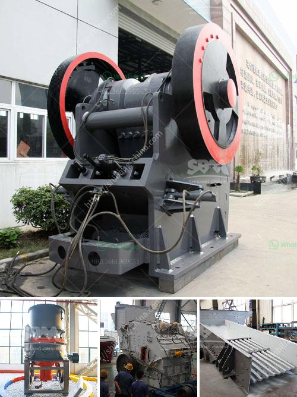

<h3>ball mill suppliers for lead processing</h3>
Lead is a toxic metal that has been widely used in industries for centuries. Due to its unique properties, lead is often used in manufacturing batteries, ammunition, and various other products. However, lead processing requires careful handling and proper equipment to ensure the safety of workers and the environment.

One crucial piece of equipment in lead processing is the ball mill. As the name suggests, a ball mill is a type of grinder used to grind materials into fine powder. It's commonly used in industries like mining and construction, where materials such as lead, limestone, or cement are pulverized to produce a desired particle size.

When it comes to choosing ball mill suppliers for lead processing, there are several factors to consider. The first and most important factor is the supplier's experience and expertise. A reputable supplier with years of experience in lead processing will have extensive knowledge of the industry's specific requirements, regulations, and best practices.

Another crucial aspect to consider is the quality of the ball mills provided by the supplier. High-quality ball mills are made of durable materials, such as stainless steel or ceramic, ensuring optimal performance and longevity. Inferior quality ball mills may not withstand the harsh conditions of lead processing, resulting in frequent breakdowns and costly repairs.

Furthermore, it's essential to consider the supplier's after-sales service and support. A reliable supplier should not only provide high-quality ball mills but also offer technical support and assistance throughout the entire process. Whether it's installation, maintenance, or troubleshooting, having a knowledgeable support team readily available can significantly minimize downtime and maximize productivity.

In addition to these factors, it's also worth considering the supplier's reputation and customer reviews. A supplier with a proven track record of delivering high-quality products and excellent customer service is more likely to meet your expectations and fulfill your lead processing needs.

1. Do your research: Look for several potential suppliers and compare their offerings, prices, and reputation.

2. Ask for recommendations: Reach out to colleagues or industry experts for recommendations on trusted ball mill suppliers.

3. Request samples or demonstrations: If possible, ask the supplier for samples of their ball mills or request a demonstration to evaluate their performance firsthand.

4. Check for certifications: Ensure the supplier complies with relevant industry standards and possesses necessary certifications, such as ISO 9001.

5. Obtain multiple quotes: Get quotes from multiple suppliers to ensure you're getting the best value for your investment.

In conclusion, choosing the right ball mill supplier for lead processing is crucial for the safety and efficiency of the operation. By considering factors like experience, quality, after-sales support, and reputation, you can make an informed decision that will ultimately benefit your lead processing facility. Remember to do thorough research, ask for recommendations, and seek out multiple quotes to ensure you're making the right choice.
<h3>Contact us</h3><ul><li><strong>Whatsapp:&nbsp;<a href="https://wa.me/8613661969651">+8613661969651</a></strong></li><li><a href="https://swt.shibang-china.com/?git&amp;zhl&amp;ball mill suppliers for lead processing"><strong>Online Service(chat now)</strong></a></li></ul><h3>Related</h3><ul><li><a href='model of crusher and steps of constructions.md'>model of crusher and steps of constructions</a></li><li><a href='jaw crusher plant in saudi.md'>jaw crusher plant in saudi</a></li><li><a href='grinding machine manufacturer for 300 mesh powder.md'>grinding machine manufacturer for 300 mesh powder</a></li><li><a href='jaw crusher manufacturers in gujarat.md'>jaw crusher manufacturers in gujarat</a></li><li><a href='lime stone crushing plant india.md'>lime stone crushing plant india</a></li></ul>