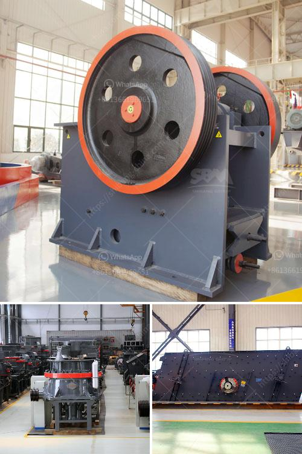

<h3>ball mill zenit crusher china</h3>
Ball mill Zenit crusher China is one of the world's leading manufacturers of mining equipment. With years of experience and a strong track record, the company has become a global leader in its field. With its high-quality products and excellent customer service, it has gained a solid reputation among its clients worldwide.

A ball mill is a type of grinder used to grind, blend, and sometimes for mixing of materials for use in mineral dressing processes, paints, pyrotechnics, ceramics, and selective laser sintering. It works on the principle of impact and attrition: size reduction is done by impact as the balls drop from near the top of the shell. A ball mill consists of a hollow cylindrical shell rotating about its axis. The axis of the shell may be either horizontal or at a small angle to the horizontal. It is partially filled with balls. The grinding media are the balls, which may be made of steel, stainless steel, ceramic, or rubber. The inner surface of the cylindrical shell is usually lined with an abrasion-resistant material such as manganese steel or rubber.

Zenit crusher China is known for its high-quality ball mills that are widely used in various mining applications. These machines are designed for long-lasting performance and durability. The company's ball mills are made from the best materials, ensuring that they can withstand the demanding conditions of the mining industry.

Zenit crusher China's ball mills are also known for their excellent grinding efficiency. They can grind various types of materials, such as cement, limestone, and ceramic. Their grinding capacity is designed to meet the growing demands of the mining industry.

Another key feature of Zenit crusher China's ball mills is their versatility. These machines can be used for both wet and dry grinding. They are equipped with different types of liners and grinding media to accommodate various materials and grinding conditions. This flexibility allows customers to use the same mill for different processes, saving time and money.

In addition to its exceptional products, Zenit crusher China also provides excellent customer service. The company has a team of knowledgeable and experienced professionals who are ready to assist customers with any inquiries or technical support they may need. Whether it's selecting the right mill for their specific application or troubleshooting any issues, Zenit crusher China's customer service team is always there to help.

Furthermore, Zenit crusher China is committed to sustainable development. The company continually invests in research and development to improve the efficiency and environmental performance of its products. This commitment has earned the company several certifications and awards, proving its dedication to sustainability.

In conclusion, Ball mill Zenit crusher China is a global leader in the mining industry, offering high-quality ball mills that are designed to meet the varying needs of its customers. With its superior products, excellent customer service, and commitment to sustainability, the company has earned a solid reputation worldwide. Its versatility and efficiency make it a preferred choice for mining companies looking for reliable and durable grinding solutions. Whether it's for wet or dry grinding, Zenit crusher China's ball mills are undoubtedly a valuable asset for any mining operation.

Overall, Ball mill Zenit crusher China is a name that stands for quality, reliability, and innovation in the mining industry. With its wide range of high-quality products and excellent customer service, the company continues to lead the way in this competitive market.
<h3>Contact us</h3><ul><li><strong>Whatsapp:&nbsp;<a href="https://wa.me/8613661969651">+8613661969651</a></strong></li><li><a href="https://swt.shibang-china.com/?git&amp;zhl&amp;ball mill zenit crusher china"><strong>Online Service(chat now)</strong></a></li></ul><h3>Related</h3><ul><li><a href='rock crusher plant cost.md'>rock crusher plant cost</a></li><li><a href='vertical roller mill industrial.md'>vertical roller mill industrial</a></li><li><a href='stone crusher in ksa.md'>stone crusher in ksa</a></li><li><a href='jaw crusher baxter.md'>jaw crusher baxter</a></li><li><a href='copper ore conveying system.md'>copper ore conveying system</a></li></ul>