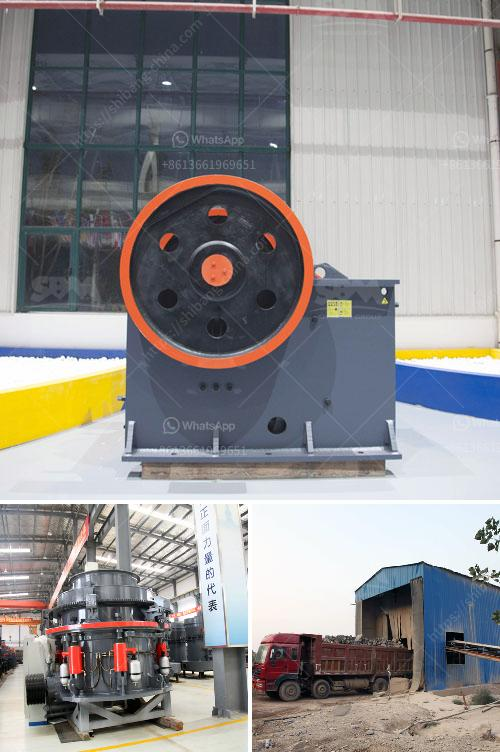

<h3>ball milling method</h3>
Ball milling is a mechanical technique widely used to grind powders into fine particles and blend materials. Being an environmentally-friendly, cost-effective technique, it has found wide application in industry all over the world. Since this mini-review mainly focuses on the conditions applied for the preparation and functionalisation of nanocellulose derivatives by ball mill, rather than the machinery itself, the different types of machines available in industry will not be herein described. However, it is nonetheless instructive to begin by summarizing the most important advantages and disadvantages of these techniques.

First, the ball mill itself has a large grinding capacity. The curvature of the conical surface of the ball mill provides a high grinding efficiency, which can reduce the grinding time and increase the yield. Second, the ball mill has less dust and noise pollution during operation. Third, it requires less operator skill compared to other grinding methods. Finally, the ball mill is versatile in terms of the materials that can be processed. It can grind and blend materials of various hardness, including fragile, ductile, or fibrous materials.

However, there are also some limitations associated with ball milling. First, it requires a relatively large amount of energy to operate. Second, it may result in contamination of the final product, especially if the balls and the material being ground have different hardness or chemical compositions. Third, there is the risk of overheating the sample during grinding, which could affect the integrity of the material. Finally, the choice of the ball material and its diameter will influence the final particle size, so careful selection is required.

In conclusion, ball milling is a powerful technique that can be used in various applications, including the preparation and modification of nanocellulose derivatives. Its advantages include high grinding capacity, minimal pollution, versatility, and ease of operation. However, it also has limitations, such as high energy consumption and the potential for sample overheating. With proper precautions and considerations, ball milling remains a valuable method in the field of materials science and engineering.
<h3>Contact us</h3><ul><li><strong>Whatsapp:&nbsp;<a href="https://wa.me/8613661969651">+8613661969651</a></strong></li><li><a href="https://swt.shibang-china.com/?git&amp;zhl&amp;ball milling method"><strong>Online Service(chat now)</strong></a></li></ul><h3>Related</h3><ul><li><a href='barite ore processing equipment rent and sale.md'>barite ore processing equipment rent and sale</a></li><li><a href='malaysia quarry crusher peninsula.md'>malaysia quarry crusher peninsula</a></li><li><a href='roll wheel pulverizer.md'>roll wheel pulverizer</a></li><li><a href='bauxite processing plant project cost.md'>bauxite processing plant project cost</a></li><li><a href='feldspar ball mills feldspar ball mills manufacturers.md'>feldspar ball mills feldspar ball mills manufacturers</a></li></ul>