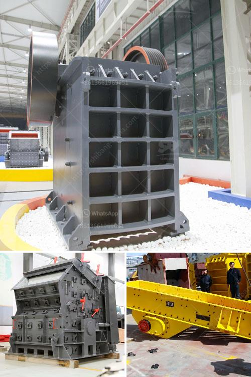

<h3>ball mills antapaccay</h3>
Ball mills are a fundamental part of the copper ore reduction process used at Antapaccay Mine in Peru. The equipment plays a vital role in providing optimized grinding solutions that yield high-quality ore particles. Without these mills, the extraction process would suffer and the overall productivity of the mine would significantly decrease.

A ball mill is a cylindrical machine consisting of a hollow cylinder that rotates on its axis. The industrial-scale ball mills at Antapaccay are driven by ring gear pinion systems, which are lubricated with high-quality grease. This ensures smooth rotation and minimal friction, reducing mechanical wear and increasing the lifespan of the equipment.

The grinding process in ball mills involves the ore being crushed into small particles by powerful grinding media, such as steel balls or ceramic beads. These grinding media are contained within the rotating cylinder and collide with the ore, reducing its size further. The rotation of the cylinder constantly lifts and drops the grinding media, subjecting the ore particles to intense impact and friction force, gradually decreasing their size.

A key advantage of using ball mills is their ability to efficiently grind ores of various hardness levels. Antapaccay Mine's ball mills are designed to handle ores with different characteristics, including those with high hardness, abrasive properties, or even soft and less abrasive ores. The mill's design allows for optimal grinding performance with minimum energy consumption, ensuring efficient use of resources.

The ball mills at Antapaccay feature advanced control systems that ensure optimal operation and product quality. These systems monitor various parameters, such as the mill speed, lubrication systems, and discharge grates, to maintain a stable and controlled grinding process. This monitoring allows operators to adjust the mill's settings in real-time, optimizing its performance and ensuring that the desired particle size distribution is achieved.

In addition to their primary grinding function, ball mills at Antapaccay also play a crucial role in the separation of valuable minerals from the ore. After the grinding process, the ore slurry is mixed with chemicals, including frothers and collectors, to facilitate the separation of copper minerals from the gangue minerals. The slurry is then fed to flotation cells, where the copper minerals are selectively separated from the rest of the ore particles.

Overall, ball mills are integral to the copper mining process at Antapaccay Mine, ensuring the extraction of high-quality copper ore. These equipment provide efficient grinding solutions, capable of handling various types of ores and optimizing overall mill performance. The advanced control systems further enhance their capabilities, allowing operators to monitor and adjust key parameters in real-time. As a result, ball mills contribute significantly towards the success and productivity of the mine, securing its position as one of the leading mines in Peru's copper industry.
<h3>Contact us</h3><ul><li><strong>Whatsapp:&nbsp;<a href="https://wa.me/8613661969651">+8613661969651</a></strong></li><li><a href="https://swt.shibang-china.com/?git&amp;zhl&amp;ball mills antapaccay"><strong>Online Service(chat now)</strong></a></li></ul><h3>Related</h3><ul><li><a href='used cement crushers for sale.md'>used cement crushers for sale</a></li><li><a href='coal processing plant in australia.md'>coal processing plant in australia</a></li><li><a href='stone crushers suppliers in south africa.md'>stone crushers suppliers in south africa</a></li><li><a href='cost of granite crushing equipment.md'>cost of granite crushing equipment</a></li><li><a href='limestone crusher secondary machine price.md'>limestone crusher secondary machine price</a></li></ul>