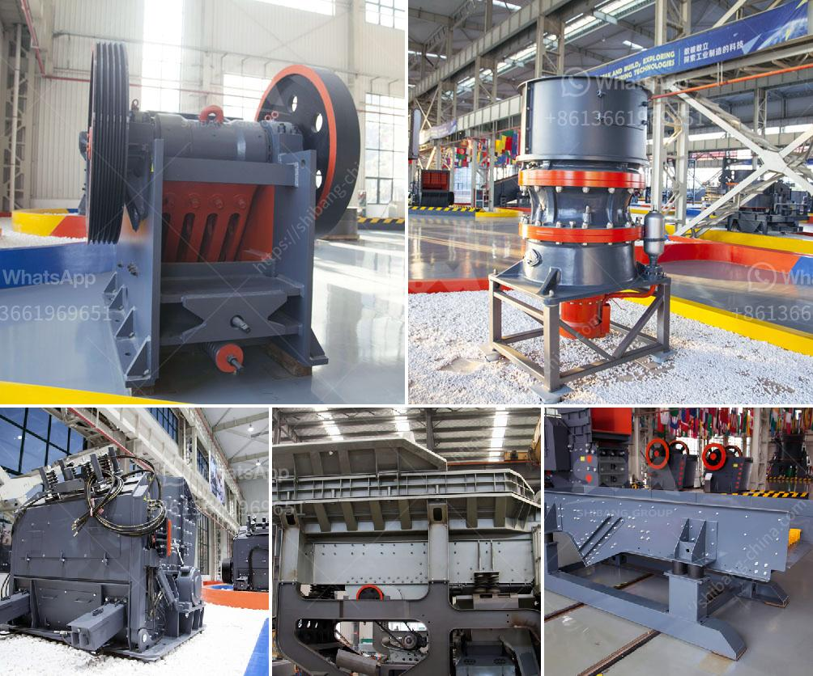

<h3>ball mills for sale south africa</h3>
Ball mills are extensively used in the industrial sector for grinding materials into fine particles. They are cylindrical devices that rotate around a horizontal axis and are partially filled with the material to be ground, along with the grinding medium. Ball mills are widely used in cement, silicate products, new building materials, refractory materials, fertilizers, black and non-ferrous metal dressings, and glass ceramics.

South Africa is the leading producer of minerals in the world and provides incredible opportunities for investors in this sector. With the advancement of mining technology, South African ball mills are developed to cater for a variety of mining applications. They are used in the mining industry to grind various minerals and produce ore pulp, which is further used for further processing.

The sale of ball mills in South Africa is a common phenomenon. The machines in this market are mainly used for mining operations. However, there are various types of ball mills for sale on the market, including those made by leading South African manufacturers such as DCD, FLSmidth, Metso, Outotec, and others. These companies provide a wide range of ball mills in different specifications, offering customers a variety of choices.

Buying a ball mill in South Africa is relatively easy because almost every mining operation has one or more of them. However, the selection of the right machine is crucial for ensuring the enhanced efficiency and profitability of the mining project. It is important to consider factors such as mill capacity, motor power, grinding medium, and feeding size when selecting a ball mill.

When looking for ball mills for sale in South Africa, consider conducting thorough research on the available options and comparing different models based on your specific needs. Choose a reputable supplier with a strong track record of providing high-quality equipment and reliable after-sales service. This is necessary to ensure a smooth operation and minimize downtime, thus maximizing the return on investment.

In conclusion, ball mills play a crucial role in the mining industry and are widely used in South Africa. Buyers should carefully consider their options and select the most suitable machine for their specific needs. By doing so, they can ensure the successful operation of their mining projects and achieve optimal profitability.
<h3>Contact us</h3><ul><li><strong>Whatsapp:&nbsp;<a href="https://wa.me/8613661969651">+8613661969651</a></strong></li><li><a href="https://swt.shibang-china.com/?git&amp;zhl&amp;ball mills for sale south africa"><strong>Online Service(chat now)</strong></a></li></ul><h3>Related</h3><ul><li><a href='production line chrome ore concentration plant mar.md'>production line chrome ore concentration plant mar</a></li><li><a href='crushing  screening plant.md'>crushing & screening plant</a></li><li><a href='used mobile crusher in nigeria.md'>used mobile crusher in nigeria</a></li><li><a href='material vibrator feeder.md'>material vibrator feeder</a></li><li><a href='stone crushing equipment price in nigeria.md'>stone crushing equipment price in nigeria</a></li></ul>