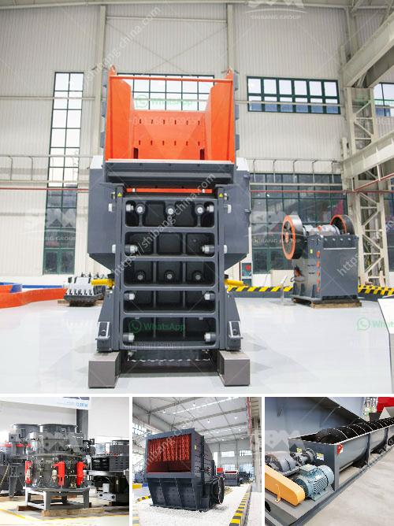

<h3>ball mills price south africa</h3>
Ball Mills are utilized for dry as well as wet grinding associated with different materials including cement materials, concrete, lime, and ceramic supplies. Binq Engineering offers continuously refurnished the actual mill to meet up with the demands associated with the milling business. Ball Mill has been available for a long period in the trading marketplace. However, it's the prospect of massive growth in the future. Ball Mills continues to be a popular and reliable type of grinding mill for mining and mineral processing industries.

A ball mill is a type of grinder used to grind and blend materials for use in various industries. A ball mill works on the principle of impact and attrition: size reduction is done by impact as the balls drop from near the top of the shell. A ball mill consists of a hollow cylindrical shell rotating about its axis. The axis of the shell may be either horizontal or at a small angle to the horizontal. It is partially filled with balls. The grinding media is the balls, which may be made of steel, stainless steel, ceramic, or rubber. The inner surface of the cylindrical shell is usually lined with an abrasion-resistant material such as manganese steel or rubber. The length of the mill is approximately equal to its diameter.

Ball Mills are primarily used for fine grinding. Ball Mill is key equipment which repulverizes the material after it is crushed. Ball Mill is widely used in powder-making production line including cement, silicate, new-type building material, refractory material, fertilizer, ore dressing of ferrous metal and non-ferrous metal, glass ceramics, etc. According to different discharging methods, it is divided into grate ball mill and overflow ball mill.

The ball mill is used to grind many kinds of mine and other materials, or to select the mine. It is widely used in building material, chemical industry, etc. There are two ways of grinding: the dry process and the wet process. It can be divided into tabular type and flowing type according to different forms of discharging material.

The ball mill is a key piece of equipment for grinding crushed materials, and it is widely used in production lines for powders such as cement, silicates, refractory material, fertilizer, glass ceramics, etc. as well as for ore dressing of ferrous and non-ferrous metals. The ball mill can grind ores and other materials either wet or dry.

In terms of price, with the same configuration (capacity, power connector, etc), D type pellet mill is cheaper than R type because the latter has smarter design of pelletizing process and a better gearbox, though both types of pellet mill are competent of making quality pellets. Ball mill suppliers in South Africa mainly referred to the price of ball mill.

The price of a ball mill in South Africa is determined by many factors, such as the model, nature of the supplier, and the specific requirements of the project. In general, the price ranges from hundreds of thousands to millions of RMB. Here are the parameters that impact the price of the ball mill:

To sum up, the ball mill is an indispensable grinding equipment for the dressing plant, and it is also one of the equipment with a large proportion of investment in the construction of the plant. Therefore, it is very important for the buyer to choose a high-quality ball mill, which is durable and has a long service life. When purchasing equipment, be sure to compare the prices of different suppliers and choose a supplier with reliable quality, reasonable price, and good reputation.
<h3>Contact us</h3><ul><li><strong>Whatsapp:&nbsp;<a href="https://wa.me/8613661969651">+8613661969651</a></strong></li><li><a href="https://swt.shibang-china.com/?git&amp;zhl&amp;ball mills price south africa"><strong>Online Service(chat now)</strong></a></li></ul><h3>Related</h3><ul><li><a href='japan crusher equipment.md'>japan crusher equipment</a></li><li><a href='barite mill in india.md'>barite mill in india</a></li><li><a href='hammer mill for ldpe grinding.md'>hammer mill for ldpe grinding</a></li><li><a href='cost to setup cement plant industry.md'>cost to setup cement plant industry</a></li><li><a href='deodorization clay processing price.md'>deodorization clay processing price</a></li></ul>