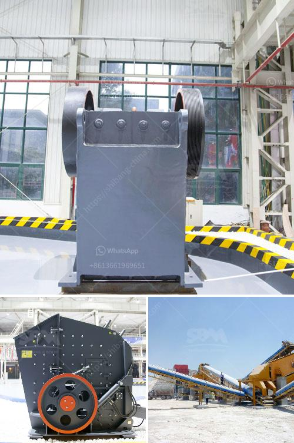

<h3>ball price for 200 tons</h3>
The price of balls, whether for sports, industrial, or other purposes, varies significantly depending on multiple factors. This article will delve into the factors affecting the price of balls when purchasing a large quantity of 200 tons.

The type of balls required significantly impacts the price. Different sports have distinct ball specifications, such as size, weight, and materials. Industrial applications may also require specialized balls. Each variation affects production costs, ultimately influencing the price.

The 200-ton purchase quantity itself creates a bulk order scenario, potentially generating savings due to economies of scale. Suppliers often offer discounts for larger orders, as they can optimize production, reduce transportation expenses, and improve profitability.

Ball prices differ depending on the desired quality and brand. Premium brands may charge a premium price due to their established reputation, using advanced technologies and materials. On the other hand, lower-priced options may provide decent quality at a more affordable price point.

The materials used for ball production significantly impact pricing. For example, high-grade leather soccer balls will cost more than synthetic leather ones. Rubber or synthetic materials used for industrial balls may also have varying costs based on quality and production processes.

The complexity of the manufacturing process can impact the overall cost. For certain types of balls, advanced machinery, skilled labor, or additional processes such as printing or customizations might be required, leading to an increase in price.

Market dynamics and overall supply and demand can cause ball prices to fluctuate over time. External factors like changes in raw material costs, exchange rates, or unexpected events can also influence prices.

When considering a 200-ton ball purchase, it is crucial to evaluate various factors that affect pricing. The type of ball, quantity, quality, raw material costs, manufacturing processes, and market dynamics all play a role. Conducting thorough research, obtaining multiple quotes, and engaging in negotiations with different suppliers will help optimize the procurement process and secure a competitive price for the desired quantity of balls.
<h3>Contact us</h3><ul><li><strong>Whatsapp:&nbsp;<a href="https://wa.me/8613661969651">+8613661969651</a></strong></li><li><a href="https://swt.shibang-china.com/?git&amp;zhl&amp;ball price for 200 tons"><strong>Online Service(chat now)</strong></a></li></ul><h3>Related</h3><ul><li><a href='nigeria mobile vsi crusher.md'>nigeria mobile vsi crusher</a></li><li><a href='ball mill suppliers for lead processing.md'>ball mill suppliers for lead processing</a></li><li><a href='components of industrial conveyor belts.md'>components of industrial conveyor belts</a></li><li><a href='stone crusher plant in maharashtra.md'>stone crusher plant in maharashtra</a></li><li><a href='300tpd cement plant price.md'>300tpd cement plant price</a></li></ul>