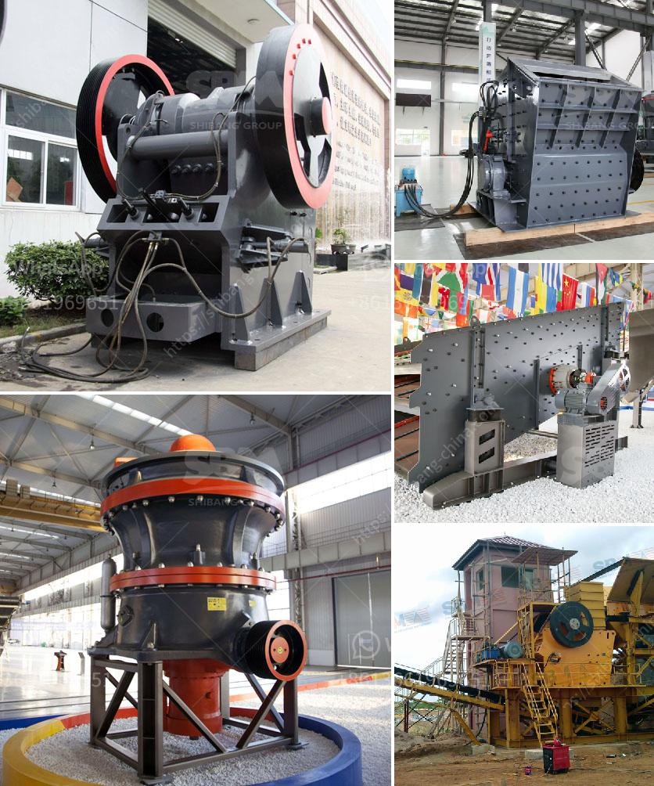

<h3>ballast crusher for sale</h3>
Are you looking for a ballast crusher for sale? If you need a ballast crusher to process railway track ballast into usable ballast supplies, then you have come to the right place. Let me introduce to you the ballast crusher for sale in the market.

According to the different types of ballast crusher machines, the ballast crusher for sale can be categorized into three types: jaw crusher, impact crusher, and cone crusher.

The jaw crusher, commonly known as the tiger mouth, has a large crushing chamber and is used for coarse crushing. It is commonly used for primary crushing of various rocks in construction projects such as pebbles and rocks with compressive strength below 320MPa.

The impact crusher has a shaping function. It is suitable for crushing medium-hard materials, such as limestone crushing in cement plants, with the advantages of large production capacity and small discharge particle size.

The cone crusher can crush various ores and rocks with medium and medium hardness. It is especially suitable for processing hard materials with high abrasiveness like ballast.

Different types of ballast crusher machines have different prices. Prices depend on the applicable range and the type of crushing machine being used. There are several ballast crusher machines available in the market today. They include jaw crushers, impact crushers, cone crushers, and vertical impact crushers.

The price of different types of ballast crusher machines is different, and different types of machines have different models, manufacturers, and sales places. The price analysis of ballast crusher machine will be introduced in detail below.

Ballast crusher machine for sale is a professional manufacturer of crushing equipment. The ballast crusher machine for sale produced by our company has been purchased and exported to various countries including South Africa, India, Indonesia, Singapore, etc. If you need a ballast crusher machine for your ballast jaw crusher, impact crusher, cone crusher, hammer crusher, etc. are all available.

As a professional manufacturer of mining equipment, SBM can provide ballast crusher machine with competitive price. Customers can choose the jaw crusher, impact crusher, and cone crusher for fine crushing. The sand making machine is used for shaping and is often used for fine crushing and shaping.

Regular maintenance and repair plays a crucial role in the maintenance of the ballast crusher machine. Proper maintenance can prolong the service life of the machine and greatly reduce the maintenance cost of the ballast crusher machine.

First of all, it is necessary to understand the structural characteristics of the ballast crusher machine, observe the working conditions of the equipment regularly, and check whether the parts of the machine are in good condition.
<h3>Contact us</h3><ul><li><strong>Whatsapp:&nbsp;<a href="https://wa.me/8613661969651">+8613661969651</a></strong></li><li><a href="https://swt.shibang-china.com/?git&amp;zhl&amp;ballast crusher for sale"><strong>Online Service(chat now)</strong></a></li></ul><h3>Related</h3><ul><li><a href='clinker making machine for sell germany.md'>clinker making machine for sell germany</a></li><li><a href='stone crushing system.md'>stone crushing system</a></li><li><a href='stone crushing plants close to rotate.md'>stone crushing plants close to rotate</a></li><li><a href='construction of vibrating screen.md'>construction of vibrating screen</a></li><li><a href='ball mill zenit crusher china.md'>ball mill zenit crusher china</a></li></ul>