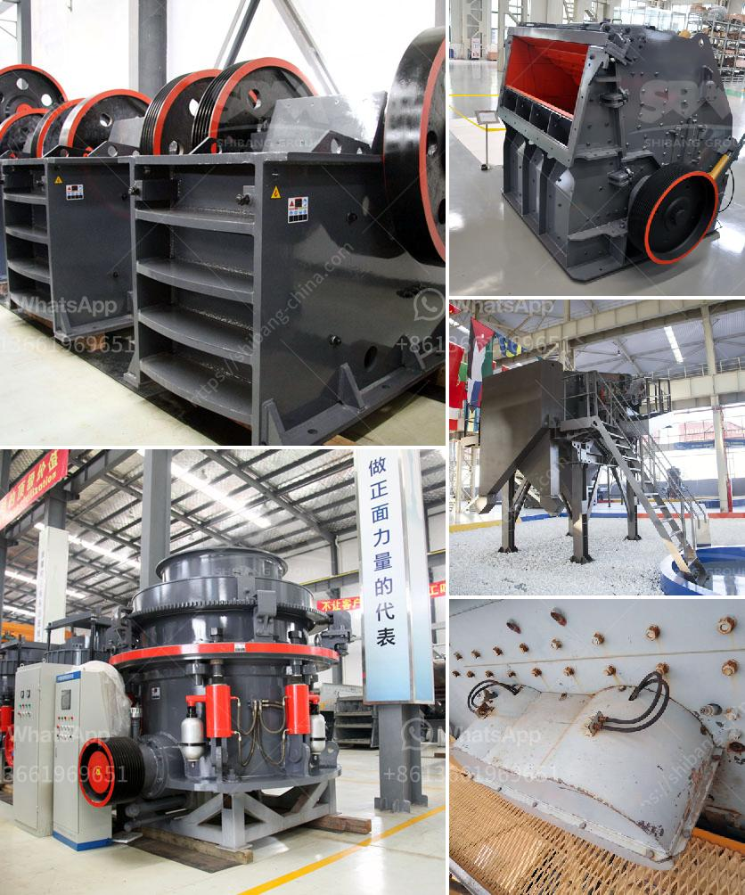

<h3>balls for ball mill</h3>
Ball mill is the key equipment for grinding after the crushing process, which is widely used in the manufacture industries, such as cement, silicate, new building material, refractory material, fertilizer, ferrous metal, nonferrous metal and glass ceramics and can be used for the dry and wet grinding for all kinds of ores and other grind-able materials. 

Ball mill is an efficient tool for grinding many materials into fine powder. The ball mill is used to grind many kinds of mine and other materials, or to select the mine. It is widely used in building material, chemical industry, etc. There are two ways of grinding: the dry process and the wet process. It can be divided into tabular type and flowing type according to different forms of discharging material. 

As we all know, the ball mill is one of the most prone to problems as a kind of grinding equipment. Its problems come from many aspects. If they are not solved well, it will cause great damage to the ball mill and affect the company's production. 

The grinding efficiency of the ball mill is determined by the amount of ore added, the grinding time, and the number of steel balls in the mill. The ore grinding efficiency is high, but the mill has a plastic lining and the grinding time is long. Therefore, the problem of over crushing is eliminated and the grinding operation is simple and convenient. However, due to the limitation of the mill volume, the grinding efficiency is low when the steel ball filling rate is too high or too low. 

In order to maximize the grinding efficiency and reduce potential problems, it is necessary to control the steel ball filling rate. The filling rate of steel balls directly affects the output and efficiency of the ball mill. Generally, the filling rate of balls should not exceed 40%. 

The quality of the steel ball is closely related to the efficiency of the ball mill grinding process and economic benefits. In order to reduce the consumption of steel balls and provide reasonable grinding conditions, there is a demand for a reasonable ratio of ball mill balls. 

Moreover, the size and proportion of the balls also play an important role in the grinding process. Generally, the larger the ball diameter is, the greater the impact force is, which improves the grinding efficiency. In addition, the proportion of grinding balls should be determined according to the actual situation.

In conclusion, the balls in the ball mill are an important factor influencing the efficiency of the ball mill. As one of the most important grinding media, the size of the balls should be properly selected according to the specific requirements. The filling rate of the steel balls should be set reasonably to maximize the grinding efficiency of the ball mill.
<h3>Contact us</h3><ul><li><strong>Whatsapp:&nbsp;<a href="https://wa.me/8613661969651">+8613661969651</a></strong></li><li><a href="https://swt.shibang-china.com/?git&amp;zhl&amp;balls for ball mill"><strong>Online Service(chat now)</strong></a></li></ul><h3>Related</h3><ul><li><a href='barium sulfate production line manufacturer.md'>barium sulfate production line manufacturer</a></li><li><a href='used concrete crushers for sale in ontario.md'>used concrete crushers for sale in ontario</a></li><li><a href='dolomite production line.md'>dolomite production line</a></li><li><a href='prices of stone crusher.md'>prices of stone crusher</a></li><li><a href='cement factory for sale in andra pradesh.md'>cement factory for sale in andra pradesh</a></li></ul>