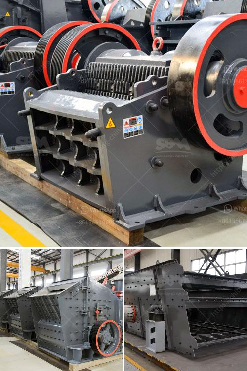

<h3>barite beneficiation plant</h3>
Barite is a mineral composed of barium sulfate (BaSO4). It is usually colorless or milky white, but can have various shades of blue, yellow, or brown. Barite is widely used in numerous industries such as oil and gas drilling, painting, and other industrial applications.

A barite beneficiation plant is designed to enhance the ore quality and increase the density of valuable mineral components. The barite beneficiation plant aims to remove impurities from the ore through multiple processes such as crushing, screening, grinding, and gravity separation.

The extracted barite ore is first crushed to reduce the size of the particles and make it easier for the next stages of processing. After crushing, the ore is sent to a vibrating screen for screening. The oversized material is then sent back to the crusher for further size reduction, while the undersized material is directly sent to a grinding mill.

In the grinding mill, the crushed barite ore is ground into a fine powder. This powder is then subjected to a process called gravity separation, which separates the valuable barite mineral from the impurities. Gravity separation relies on the difference in density between the barite and the gangue minerals.

The final step of the barite beneficiation process involves dewatering the product to remove excess water and obtain the desired moisture content. This can be achieved by using various dewatering techniques such as filtration or drying.

A well-designed barite beneficiation plant ensures that the final product meets the specifications required by various industries. The high-quality barite obtained from the beneficiation process has a higher density, making it more suitable for applications such as drilling mud for oil and gas wells.

In conclusion, a barite beneficiation plant is essential for improving the quality and density of barite ore. This process involves crushing, screening, grinding, gravity separation, and dewatering to obtain a high-quality final product. The increased density of the barite obtained from the beneficiation process makes it a valuable mineral for a wide range of industries.
<h3>Contact us</h3><ul><li><strong>Whatsapp:&nbsp;<a href="https://wa.me/8613661969651">+8613661969651</a></strong></li><li><a href="https://swt.shibang-china.com/?git&amp;zhl&amp;barite beneficiation plant"><strong>Online Service(chat now)</strong></a></li></ul><h3>Related</h3><ul><li><a href='marble and granite grinder and crusher.md'>marble and granite grinder and crusher</a></li><li><a href='manganese washing equipment cost.md'>manganese washing equipment cost</a></li><li><a href='cheap stone crushing plant.md'>cheap stone crushing plant</a></li><li><a href='size of balls in ball mill.md'>size of balls in ball mill</a></li><li><a href='stone quarry crusher equipment.md'>stone quarry crusher equipment</a></li></ul>