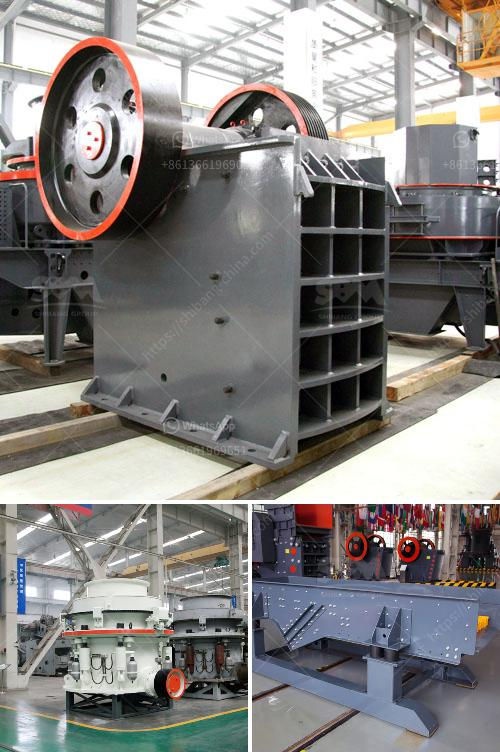

<h3>barite crusher processing plant</h3>
Barite crushing and grinding stage is crucial for the complete processing of barite. The main machinery involved in the process includes barite crusher, jaw crusher, impact crusher, cone crusher, barite grinding mill, Raymond mill, and high pressure mill.

During the crushing process, barite material will be crushed by crusher machines. After crushing, the barite material will be sent for the magnetic separation, and then into the grinding mill stage. As we all know, the mill is the most important part of the whole barite processing plant. How to choose the right mill to process the barite?

The barite material should be crushed and screened before processing. The barite material after crushed enters the mill evenly through the vibrating feeder. Then the material is quantitatively and continuously sent to the grinding chamber of the mill for grinding. The ground barite powder is collected by the dust collector, and then sent to the analysis machine for sorting. The sorted barite powder is evenly sent to the storage bin for subsequent use.

The crushing stage is the primary process of the barite ore processing line. The barite crusher machine will help to get the raw materials into the production size for further application. Want to get the detailed information or specific barite crusher machines? Please contact us.

Barite grinding mill is an ideal large-scale grinding equipment, a combination of grinding technology, set of crushing, drying, grinding, grading conveyor in one, high production efficiency. barite grinding mill can be widely used in cement, power, metallurgy, chemical industry, non-metallic mineral industries. Commonly used in fine grinding slag ore processing. Ultrafine grinding technology has been widely used in chemical, metallurgy, mining, building materials, chemical, food, medicine, agriculture, environmental protection and aerospace and other fields.

The barite grinding mill is advanced milling equipment, which integrates crushing, drying, grinding and grading conveyor. It has advantages of high grinding efficiency, low power consumption, large feeding size, easy adjustment of product fineness, simple equipment process, and so on.

Barite grinding mill price is reasonable and the quality is guaranteed. We have decades of mining equipment R&D and manufacturing experience, our company produced the barite grinding mill parts stable quality, come and buy!

In the barite processing plant, jaw crusher is often used as primary crusher, barite cone crusher is the secondary crusher, barite grinding mill can be combined with other equipment, to form a complete barite processing line. Compared with fixed processing line, barite mobile crusher has a number of advantages. Our barite mobile crusher plant has features of reliable construction, high productivity, easy adjustment and low operating cost. It will be the best choice for barite primary crushing.
<h3>Contact us</h3><ul><li><strong>Whatsapp:&nbsp;<a href="https://wa.me/8613661969651">+8613661969651</a></strong></li><li><a href="https://swt.shibang-china.com/?git&amp;zhl&amp;barite crusher processing plant"><strong>Online Service(chat now)</strong></a></li></ul><h3>Related</h3><ul><li><a href='used raymond mill for sale.md'>used raymond mill for sale</a></li><li><a href='margalla stone crusher in islamabad.md'>margalla stone crusher in islamabad</a></li><li><a href='portable stone crusher machine for sale.md'>portable stone crusher machine for sale</a></li><li><a href='raymond mills usa.md'>raymond mills usa</a></li><li><a href='crushers stone crushers price.md'>crushers stone crushers price</a></li></ul>