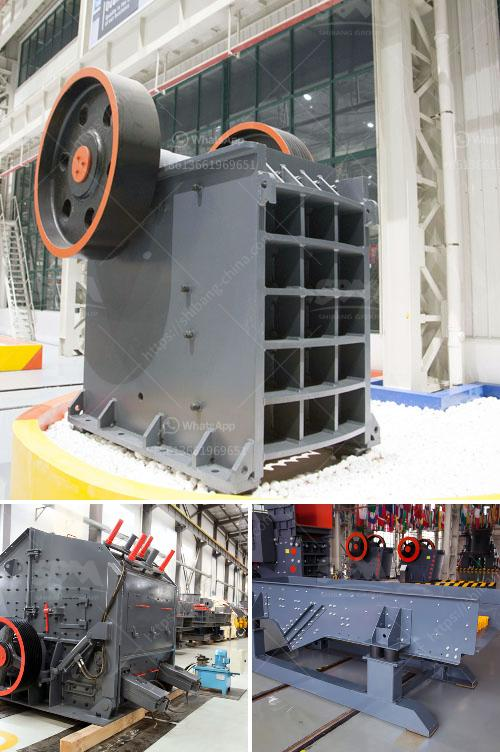

<h3>barite mill in india</h3>
Barite, also known as baryte, is a naturally occurring mineral widely used in industries like oil and gas drilling, paint and coating, pharmaceutical, and cosmetic. It is an essential industrial mineral due to its high specific gravity, low hardness, and chemically inert nature. India is one of the leading producers of barite, with significant deposits located in the states of Andhra Pradesh and Rajasthan.

India's barite mill industry has been growing rapidly in recent years, driven by the country's booming oil and gas exploration and drilling activities. The demand for barite in the oil and gas industry is primarily attributed to its ability to control the pressure in oil wells and prevent blowouts. It is used as a weighing agent in drilling fluids and helps to maintain the stability of the borehole during the drilling process.

The barite mill in India plays a crucial role in the country's industrial sector. It serves as a significant source of employment and economic growth in the regions where it is located. The mill extracts, processes, and produces high-quality barite powder used in various industries. The raw barite is ground to a fine powder, which is then used in drilling fluids, pigment industries, and others.

One of the leading barite mills in India is located in Kadapa, Andhra Pradesh. The mill is equipped with state-of-the-art machinery and technology, ensuring the production of premium quality barite powder. It adheres to strict quality control measures to meet the requirements of its diverse customers. The mill in Kadapa has also significantly contributed to the development of the local economy by generating employment opportunities and promoting industrial growth.

In conclusion, the barite mill industry in India has witnessed substantial growth due to the rising demand for barite in various sectors, particularly in oil and gas exploration. The presence of abundant barite deposits in the country has provided a significant advantage in meeting the domestic demand and catering to the international market. With the continuous technological advancements and focus on quality, the barite mill in India is poised for further expansion and contribution to the country's industrial development.
<h3>Contact us</h3><ul><li><strong>Whatsapp:&nbsp;<a href="https://wa.me/8613661969651">+8613661969651</a></strong></li><li><a href="https://swt.shibang-china.com/?git&amp;zhl&amp;barite mill in india"><strong>Online Service(chat now)</strong></a></li></ul><h3>Related</h3><ul><li><a href='ball mill capacity tons.md'>ball mill capacity tons</a></li><li><a href='italia dry production line supplier.md'>italia dry production line supplier</a></li><li><a href='stone crushing making machine.md'>stone crushing making machine</a></li><li><a href='lime manufacturing process.md'>lime manufacturing process</a></li><li><a href='portable stone crusher machine for sale.md'>portable stone crusher machine for sale</a></li></ul>