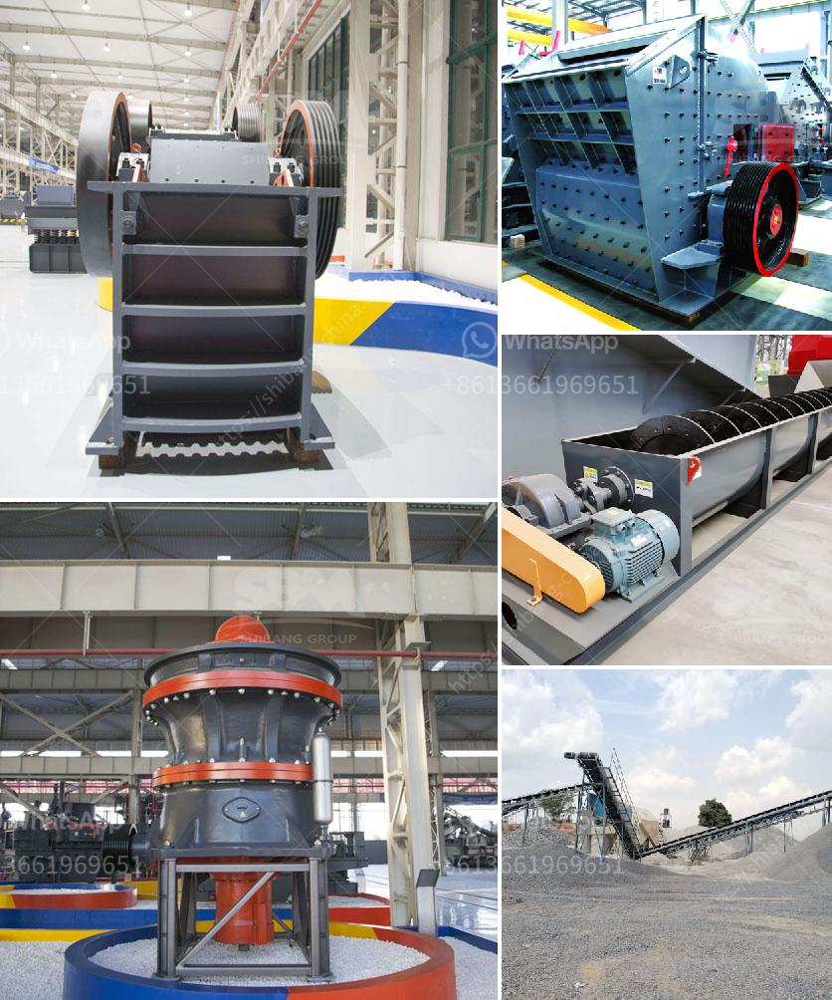

<h3>barite mill saltillo</h3>
Saltillo, a scenic city located in the northeastern part of Mexico, is famous not only for its rich history and cultural heritage but also for being a hub of economic activities. One particular industry that has flourished in Saltillo is the barite milling industry. The establishment of barite mills in Saltillo has contributed significantly to the city's economic prosperity and brought numerous benefits to the local economy and community.

Barite, a mineral composed of barium sulfate, is extensively used in various industries, including oil and gas drilling, paint and coatings, pharmaceuticals, and rubber. The presence of large barite deposits in the surrounding areas of Saltillo made it an ideal location for setting up barite mills. These mills process the crude barite extracted from the mines into a fine powder, which is then used in different applications.

One of the primary benefits of having barite mills in Saltillo is the creation of employment opportunities for the local population. The milling industry requires a skilled workforce to operate and manage the mills. From machine operators to chemists and engineers, these mills provide stable and well-paying jobs to the residents of Saltillo. This not only reduces unemployment but also improves the standard of living for many families in the region.

Furthermore, the establishment of barite mills has a positive impact on related industries. For instance, the transportation sector benefits from the increased demand for logistics services to transport the extracted barite to the mills and distribute the finished products. Additionally, the manufacturing sector experiences growth as it supplies equipment and machinery required for the operation of these mills. This ripple effect of economic activity generates more employment opportunities across various sectors, stimulating overall economic growth.

Moreover, the presence of barite mills in Saltillo attracts investments and promotes the growth of ancillary businesses in the region. Investors see the potential market opportunities associated with the milling industry and are motivated to establish supporting businesses such as packaging companies, quality testing laboratories, and maintenance service providers. This diversification of the local economy not only strengthens the industrial base of Saltillo but also ensures its resilience against economic downturns.

In addition to economic benefits, the barite milling industry also contributes to environmental sustainability. The mills employ advanced technologies and processes that effectively minimize the environmental impact associated with mineral extraction and processing. Waste management systems and water treatment facilities ensure responsible handling of by-products, reducing the industry's carbon footprint. This commitment to sustainability showcases Saltillo's dedication to economic development without compromising the environment.

In conclusion, the establishment of barite mills in Saltillo has proven to be a game-changer for the city's economy, bringing forth numerous benefits to the local community. From job creation to attracting investments and promoting environmental sustainability, the barite milling industry has become a catalyst for economic growth and prosperity. As the industry continues to thrive, Saltillo remains a shining example of how strategic investments in natural resources can transform a region and its people.
<h3>Contact us</h3><ul><li><strong>Whatsapp:&nbsp;<a href="https://wa.me/8613661969651">+8613661969651</a></strong></li><li><a href="https://swt.shibang-china.com/?git&amp;zhl&amp;barite mill saltillo"><strong>Online Service(chat now)</strong></a></li></ul><h3>Related</h3><ul><li><a href='purchase of cement crusher machines.md'>purchase of cement crusher machines</a></li><li><a href='grinding machinery manufecture in africa.md'>grinding machinery manufecture in africa</a></li><li><a href='stone crusher in oman.md'>stone crusher in oman</a></li><li><a href='ball mill for grinding metal.md'>ball mill for grinding metal</a></li><li><a href='aggregate crushing process.md'>aggregate crushing process</a></li></ul>