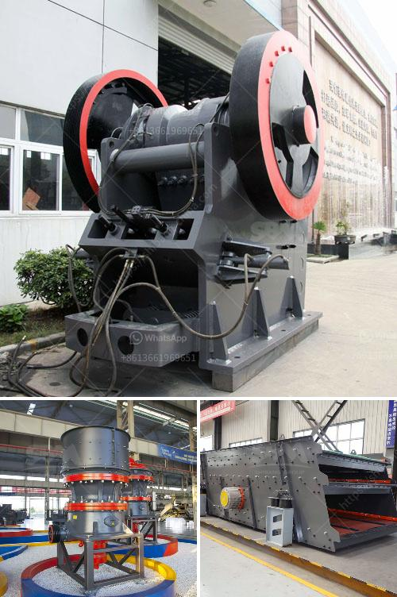

<h3>barite mining crusher process</h3>
Barite, a mineral composed of barium sulfate, is commonly used in industries such as petroleum, chemicals, paint, and rubber. The booming demand for barite has led to an increase in mining activities. However, the process of extracting and refining barite can be challenging and environmentally damaging.

The first step in the mining process is the exploration and prospecting of deposits. This involves the use of various geophysical techniques to identify potential locations for barite extraction. Once a suitable deposit is found, the extraction process begins.

Barite can be extracted through both open pit mining and underground mining methods. Open pit mining involves removing the layers of earth above the barite deposit to expose the veins. Underground mining, on the other hand, requires tunneling into the earth to reach the barite deposits. The mining method used depends on the depth and size of the deposit.

After the extraction process, the ore is crushed and ground to separate barite from other minerals. The crushing process uses jaw crushers or gyratory crushers to reduce the size of the ore particles. The ground particles are then further refined through gravity separation or magnetic separation to achieve the desired purity.

In the gravity separation process, crushed barite ore is suspended in water and subjected to the force of gravity. This allows the heavier barite particles to settle at the bottom while the lighter impurities float to the surface. The separation is then achieved by collecting the concentrated barite.

Magnetic separation, on the other hand, utilizes magnets to separate the barite from other minerals. The crushed ore is passed through a magnetic field, which attracts the barite particles. Once separated, the barite is collected and further processed.

The final step in the barite mining process is refining and processing to meet the specifications of the end-users. This involves further grinding the ore into a fine powder, purifying it through washing or acid treatment, and drying it to produce the final product.

While barite mining plays an important role in various industries, it also has potential negative impacts on the environment. Mining activities can lead to deforestation, habitat destruction, and soil erosion. To minimize these impacts, responsible mining practices should be implemented, such as reforestation programs and land rehabilitation.

Furthermore, the refinement and processing of barite can result in the release of pollutants into the air, water, and soil. It is crucial for mining companies to comply with environmental regulations, invest in pollution control measures, and promote sustainable waste management practices.

In conclusion, barite mining is a complex process that requires careful planning, responsible extraction methods, and sustainable practices. Given the increasing demand for barite, it is essential for mining companies to prioritize environmental protection and address the potential negative impacts. By adopting responsible mining practices, the industry can continue to thrive while minimizing its ecological footprint.
<h3>Contact us</h3><ul><li><strong>Whatsapp:&nbsp;<a href="https://wa.me/8613661969651">+8613661969651</a></strong></li><li><a href="https://swt.shibang-china.com/?git&amp;zhl&amp;barite mining crusher process"><strong>Online Service(chat now)</strong></a></li></ul><h3>Related</h3><ul><li><a href='stone crusher machine for sale in ethiopia.md'>stone crusher machine for sale in ethiopia</a></li><li><a href='objective of ball mill machine.md'>objective of ball mill machine</a></li><li><a href='crusher plant in india.md'>crusher plant in india</a></li><li><a href='cost cone crusher.md'>cost cone crusher</a></li><li><a href='sand conveyors for rent.md'>sand conveyors for rent</a></li></ul>