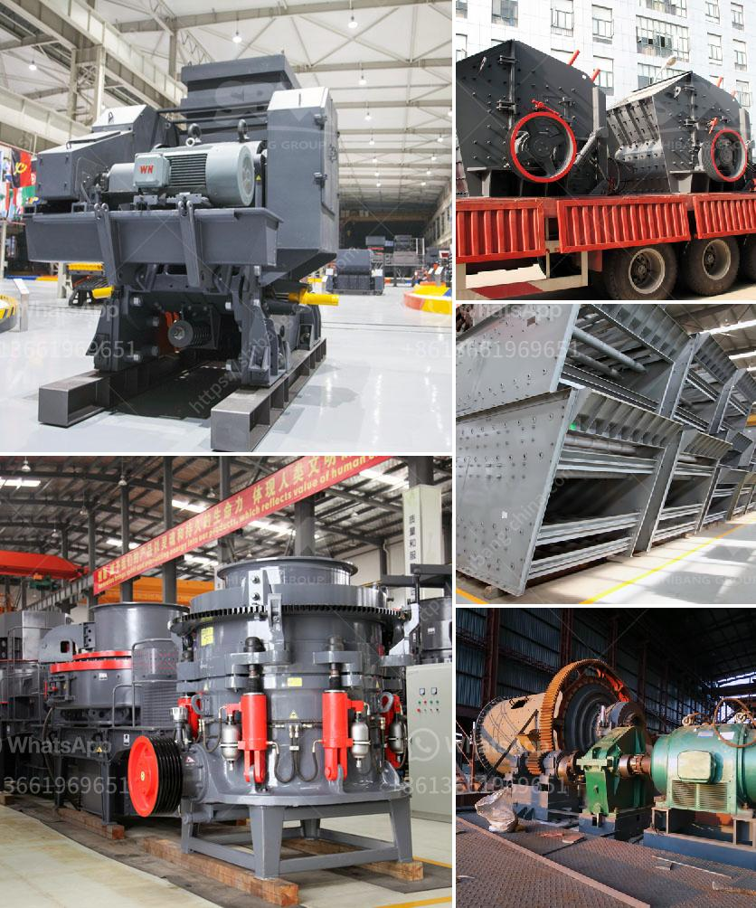

<h3>barite ore processing equipment rent and sale</h3>
Barite is a mineral composed of barium sulfate. It is commonly used in various industries such as oil and gas, drilling mud, paint, and pharmaceuticals. The high demand for barite has led to the development of various barite ore processing equipment rent and sale options.

Barite ore processing equipment includes crusher, vibrating screen, jigging machine, and dewatering screen; sometimes, it also needs ore washing machine and other equipment. The raw ore must be crushed, so that the barite ore particle size will be controlled in a certain range for washing. Therefore, the crushing equipment is essential in barite ore processing plant.

For the barite ores with less mud content, they can directly enter the gravity separation process after crushing and screening. For the barite ores with large amount of mud, additional washing process is needed. The washing process includes two-step washing, three-step washing, and four-step washing, which are determined according to the mud content.

In recent years, the market demand for barite has been on the rise, leading to an increase in the number of barite ore processing equipment rent and sale. The equipment rental market allows customers to rent the necessary machinery to process their minerals without the need for massive capital investment. This is particularly beneficial for small and medium-sized mining operations that may not have the resources to purchase expensive equipment outright.

On the other hand, equipment sales provide a more permanent solution for mining companies that have a consistent need for barite ore processing equipment. By purchasing the equipment, these companies can ensure a steady supply of barite products for their operations and potentially save money in the long run.

Overall, the availability of barite ore processing equipment for rent and sale is an indication of the growing market demand for this mineral. The mining industry can choose to either rent or buy the equipment depending on its unique needs and budget considerations. With the right equipment, mining companies can efficiently process barite ore and meet the increasing demand from various industries.
<h3>Contact us</h3><ul><li><strong>Whatsapp:&nbsp;<a href="https://wa.me/8613661969651">+8613661969651</a></strong></li><li><a href="https://swt.shibang-china.com/?git&amp;zhl&amp;barite ore processing equipment rent and sale"><strong>Online Service(chat now)</strong></a></li></ul><h3>Related</h3><ul><li><a href='cost cone crusher.md'>cost cone crusher</a></li><li><a href='concrete crushing machines.md'>concrete crushing machines</a></li><li><a href='mining jaw crusher pe.md'>mining jaw crusher pe</a></li><li><a href='ball mill in zimbabwe for sale.md'>ball mill in zimbabwe for sale</a></li><li><a href='second hand stone crusher sale in india.md'>second hand stone crusher sale in india</a></li></ul>