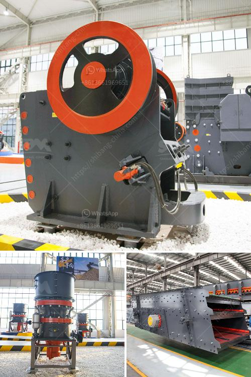

<h3>barite production process</h3>
Barite, also known as barytes or heavy spar, is a mineral commonly found in nature. It is largely composed of barium sulfate and has numerous industrial applications due to its high specific gravity and chemical inertness. The process of barite production starts with the mining of barite ore, which is then extracted, ground, and upgraded through various physical and chemical processes.

The mining of barite begins with the removal of overburden (dirt and clay) using heavy machinery, such as bulldozers and excavators, followed by the drilling and blasting of the ore-bearing rock. The extracted ore is then transported to a processing plant, where it undergoes crushing, grinding, and screening to produce finely ground barite powder.

In the crushing stage, jaw crushers or gyratory crushers are typically used to reduce the size of the raw ore. After crushing, the ore is further ground by ball or rod mills to produce a fine powder. The finely ground barite is then classified using screens or air classifiers to separate the desired particle size ranges.

Next, the classified barite is subjected to various chemical processes to enhance its quality for specific applications. These processes may include froth flotation, magnetic separation, or gravity concentration, depending on the desired purity, brightness, and specific gravity of the final product.

Froth flotation involves the addition of chemicals to the ground barite slurry to selectively adhere to and float the desired barite particles. Magnetic separation utilizes magnets to separate magnetic materials from non-magnetic ones, effectively removing impurities from the barite concentrate. Gravity concentration relies on the differences in specific gravity between barite and other unwanted minerals to separate them.

Once the desired purity and quality are achieved, the barite concentrate is dried, packaged, and shipped for various applications. Barite is commonly used as a weighting agent in drilling fluids in the oil and gas industry to control well bore pressures and prevent blowout. It is also used as a filler in paints, plastics, and rubber, as well as a flux in glass manufacturing.

In conclusion, the production of barite involves the mining, crushing, grinding, and upgrading of barite ore. Various physical and chemical processes are employed to produce the desired particle size and quality of the final product. The versatility and unique properties of barite make it a valuable mineral in various industries.
<h3>Contact us</h3><ul><li><strong>Whatsapp:&nbsp;<a href="https://wa.me/8613661969651">+8613661969651</a></strong></li><li><a href="https://swt.shibang-china.com/?git&amp;zhl&amp;barite production process"><strong>Online Service(chat now)</strong></a></li></ul><h3>Related</h3><ul><li><a href='iron jaw crusher with output of mm.md'>iron jaw crusher with output of mm</a></li><li><a href='functions of the hammer mill.md'>functions of the hammer mill</a></li><li><a href='coal crusher manufacturer.md'>coal crusher manufacturer</a></li><li><a href='dense medium separation equipment supplier.md'>dense medium separation equipment supplier</a></li><li><a href='cost of grizzly crusher.md'>cost of grizzly crusher</a></li></ul>