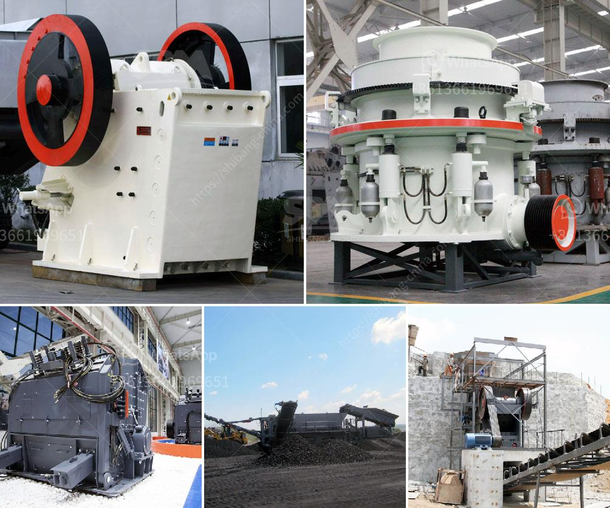

<h3>barite raymond mill</h3>
Barite is a kind of non-metallic mineral commonly found in nature. It has a wide application in various industries due to its excellent properties. With the development of the market, the demand for barite powder is constantly increasing. In order to meet the market demand, barite Raymond mill has emerged as the market's favorite grinding equipment.

Barite Raymond mill is a new type of powder grinding mill that is developed on the basis of the traditional Raymond mill. It is designed for grinding barite, limestone, kaolin, cement, slag, etc. This high-efficiency grinding mill combines grinding, drying, grinding, grading, and conveying into one unit. It has the advantages of compact structure, simple operation, convenient maintenance, stable performance, high efficiency, and low energy consumption.

The working principle of barite Raymond mill is mainly composed of the host, i.e., the grinding roller device, the grinding ring device, the blade device, the air-intake volute, the finished cyclone separator, the pipe device, the motor, and the auxiliary equipment. When working, the material is evenly fed into the center of the grinding disc through the feeding device, and under the action of centrifugal force, it moves to the edge of the grinding disc and is crushed by the grinding roller.

The crushed material is brought up by the high-speed airflow generated by the wind ring at the edge of the grinding disc, and the powder selected by the classifying device is collected into the cyclone separator. The coarse particles are returned to the grinding disc for re-grinding, and the qualified fine powder is collected by the cyclone separator and discharged through the discharge device to become the finished product.

1. High grinding efficiency: The grinding roller is tightly pressed on the grinding ring by the centrifugal force, so it has a strong grinding ability and high grinding efficiency.

2. Good product fineness: The particle size of the finished product can be adjusted arbitrarily between 80-400 mesh, and the screening rate can reach 99%.

3. Low energy consumption: The power consumption of the system is only one-third of that of the airflow mill, which can effectively reduce operating costs.

4. Wide range of application: It can be used for grinding various non-metallic minerals with Mohs hardness below 7 and humidity below 6%, such as barite, limestone, kaolin, marble, talc, gypsum, bauxite, feldspar, pyrophyllite, etc.

In summary, barite Raymond mill is an ideal choice for grinding barite powder. It is a high-efficiency grinding equipment manufactured by a professional manufacturer. It has the characteristics of stable performance, low energy consumption, high efficiency, and good product fineness. It can meet the production needs of various industries and create greater value for customers. As the market demand for barite powder continues to grow, the use of barite Raymond mill will become more and more widespread.
<h3>Contact us</h3><ul><li><strong>Whatsapp:&nbsp;<a href="https://wa.me/8613661969651">+8613661969651</a></strong></li><li><a href="https://swt.shibang-china.com/?git&amp;zhl&amp;barite raymond mill"><strong>Online Service(chat now)</strong></a></li></ul><h3>Related</h3><ul><li><a href='limestone hammer mill process.md'>limestone hammer mill process</a></li><li><a href='slag grinding machine.md'>slag grinding machine</a></li><li><a href='granite quarry machines.md'>granite quarry machines</a></li><li><a href='limestone impact mill price.md'>limestone impact mill price</a></li><li><a href='crusher on rent basis in nigeria.md'>crusher on rent basis in nigeria</a></li></ul>