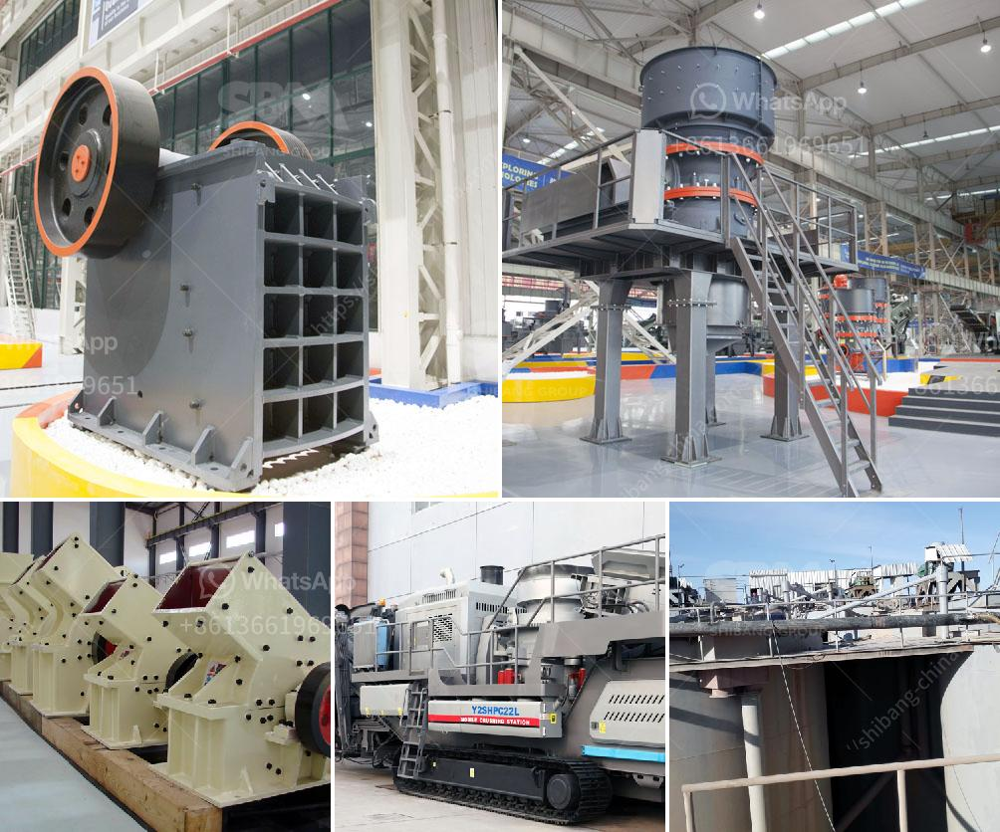

<h3>barium sulfate production line manufacturer</h3>
Barium sulfate, also known as barite, is a compound that is highly valued for its wide range of industrial applications. From its use in the oil and gas industry as a weighting agent in drilling fluids, to its use as a pigment in paints and coatings, barium sulfate is an essential component in various manufacturing processes. Consequently, the demand for barium sulfate has been steadily increasing, leading to the rise of specialized manufacturers who cater to the production of this compound.

A reliable and efficient barium sulfate production line manufacturer plays a crucial role in meeting this growing demand. These manufacturers utilize advanced technology and equipment to produce high-quality barium sulfate in large quantities. They follow stringent quality control measures to ensure that the product meets or exceeds industry standards. Moreover, they focus on optimizing their production processes to reduce time and cost while maintaining product consistency.

The production line typically consists of several interconnected machines that perform different functions. In the initial stages, raw materials, such as barite ore, are crushed and ground to a suitable particle size. Then, these particles are chemically treated to remove impurities and enhance the purity of barium sulfate. Subsequently, the material is subjected to various physical and chemical processes, including precipitation, filtration, washing, drying, and packaging. Throughout the production line, the manufacturer continuously monitors and adjusts parameters to achieve the desired quality and efficiency.

Choosing a reputable barium sulfate production line manufacturer is crucial for businesses that rely on this compound. A well-established manufacturer not only ensures a steady supply of high-quality products but also provides technical assistance and after-sales support. By collaborating with such manufacturers, businesses can streamline their production processes, improve product consistency, and gain a competitive edge in the market.

In conclusion, the production of barium sulfate is an intricate process that requires specialized manufacturers with advanced technology and expertise. These manufacturers are essential for meeting the increasing demand for barium sulfate and ensuring its availability across various industries. Therefore, businesses must carefully select reliable manufacturers who can deliver consistent quality products and provide valuable support throughout the production line.
<h3>Contact us</h3><ul><li><strong>Whatsapp:&nbsp;<a href="https://wa.me/8613661969651">+8613661969651</a></strong></li><li><a href="https://swt.shibang-china.com/?git&amp;zhl&amp;barium sulfate production line manufacturer"><strong>Online Service(chat now)</strong></a></li></ul><h3>Related</h3><ul><li><a href='barite mill saltillo.md'>barite mill saltillo</a></li><li><a href='iron ore pellet plant technology suppliers.md'>iron ore pellet plant technology suppliers</a></li><li><a href='sample of granite quarry proposal.md'>sample of granite quarry proposal</a></li><li><a href='what are they vertical grinding mills.md'>what are they vertical grinding mills</a></li><li><a href='dense medium separation equipment supplier.md'>dense medium separation equipment supplier</a></li></ul>