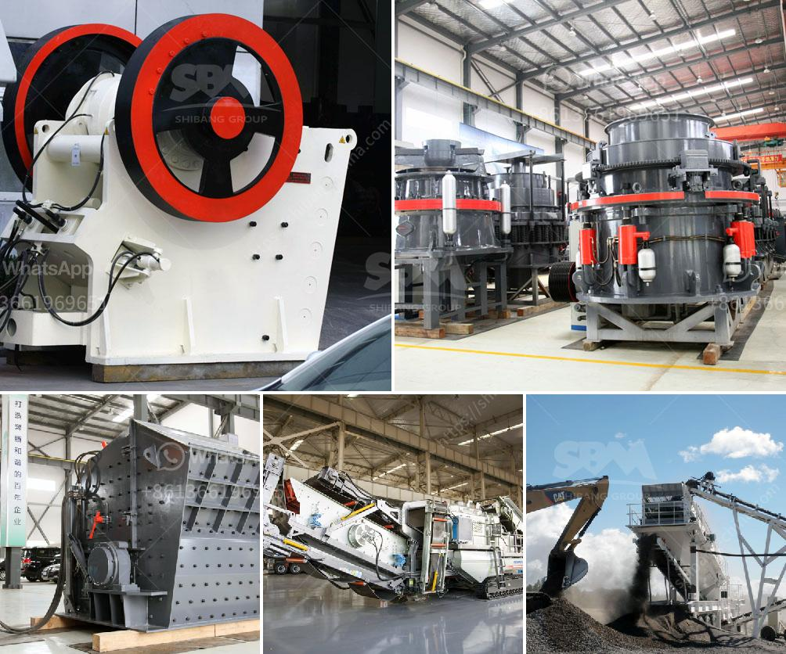

<h3>barmac crushers for sale</h3>
In the world of crushing equipment, the name Barmac is synonymous with quality, efficiency, and success. Today, the renowned brand offers several types of impact crushers globally, each designed to improve the performance and reduce the operating costs of various industries.

Barmac crushers are a popular choice for operations of all sizes due to their ability to crush a wide range of materials efficiently. From soft rocks to hard minerals, these machines excel at transforming even the toughest feed materials into high-quality aggregates or sand. With a unique rock-on-rock crushing principle, Barmac crushers ensure high reduction ratios and superior particle shape.

Apart from their exceptional performance, another reason for the popularity of Barmac crushers is their low operating costs. These machines consume less power and require minimal maintenance, resulting in significant savings in terms of both fuel and crusher wear parts. Additionally, Barmac crushers often provide better reliability and longer intervals between maintenance events, allowing operators to focus on their core business operations.

Whether you are in the construction, mining, or recycling industry, Barmac crushers deliver unmatched versatility. Their modular design facilitates easy integration into existing plants, ensuring the optimization of your production processes. Furthermore, Barmac crushers can be adapted to different applications through simple adjustments, making them the go-to choice for any organization looking to enhance their crushing operations.

For those seeking an environmentally friendly solution, Barmac crushers are an excellent option. With their excellent particle shape control, these machines minimize the need for additional processing stages, reducing energy consumption and emissions associated with secondary crushing operations.

In conclusion, Barmac crushers for sale offer a range of benefits that make them an essential investment for any business seeking to optimize their crushing operations. With their exceptional performance, low operating costs, and eco-friendly design, Barmac crushers are revolutionizing the crushing industry and setting new standards for efficiency and productivity.
<h3>Contact us</h3><ul><li><strong>Whatsapp:&nbsp;<a href="https://wa.me/8613661969651">+8613661969651</a></strong></li><li><a href="https://swt.shibang-china.com/?git&amp;zhl&amp;barmac crushers for sale"><strong>Online Service(chat now)</strong></a></li></ul><h3>Related</h3><ul><li><a href='prices of copper smelting plant.md'>prices of copper smelting plant</a></li><li><a href='rock crushing equipment to make stone dust.md'>rock crushing equipment to make stone dust</a></li><li><a href='vibrating screens manufacturer south africa.md'>vibrating screens manufacturer south africa</a></li><li><a href='pakistan chromite crusher equipment.md'>pakistan chromite crusher equipment</a></li><li><a href='supplier of conveyor belt kenya.md'>supplier of conveyor belt kenya</a></li></ul>