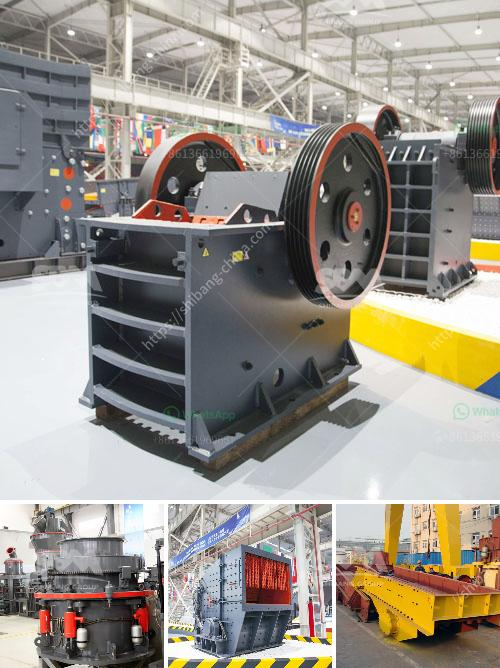

<h3>barytes pulverizer mill for sale india</h3>
Barytes, also known as barite, is a mineral that is found in sedimentary rocks. It is primarily composed of barium sulfate and has various industrial applications. Barytes pulverizer mill, also called barytes grinding mill, is a grinding machine designed specifically for the processing of barytes. With the development of the mining industry in India, the demand for barytes pulverizer mill has increased significantly.

India is rich in barytes resources and it has abundant reserves of barytes. The mining of barytes in India can be traced back to ancient times when it was mined for use in traditional medicines and as a pigment in paintings. Today, barytes is used in various industries such as oil and gas drilling, paints and coatings, rubber, plastics, and pharmaceuticals.

The barytes pulverizer mill is a grinding machine that consists of a surface area filled with barytes powder. The pulverizer mill can be used to grind the materials into fine powder, which is much finer than the traditional grinder. It has the advantages of low energy consumption, high efficiency, and easy operation.

In India, there are many suppliers and manufacturers of barytes pulverizer mill. Shanghai Clirik Machinery Co., Ltd is one of the leading manufacturers of grinding mills for minerals. With years of experience and expertise in the field of grinding, Clirik has developed a wide range of grinding mills, including barytes pulverizer mill. Their barytes pulverizer mill for sale India is of high-quality and competitive price. They also provide other types of grinding mills, such as Raymond mill, ultrafine mill, vertical mill, and hammer mill.

When purchasing a barytes pulverizer mill, there are several factors that need to be considered. Firstly, the capacity of the mill should be taken into account. The capacity of the mill determines the amount of barytes powder that can be produced in a given time. Secondly, the fineness of the powder is also important. Different industries have different requirements for the fineness of the powder, so it is necessary to choose a mill with adjustable fineness.

Another important consideration is the after-sales service provided by the manufacturer. A reliable manufacturer should offer comprehensive after-sales service, including installation guidance, technical support, and spare parts supply. A good after-sales service can ensure the smooth operation of the mill and reduce maintenance costs.

In conclusion, the demand for barytes pulverizer mill in India is increasing due to the growth of the mining industry. The barytes pulverizer mills offered by Shanghai Clirik Machinery Co., Ltd are of high-quality and competitive price. They are a reliable choice for customers in India who are looking for a barytes pulverizer mill. With their high efficiency, easy operation, and comprehensive after-sales service, the barytes pulverizer mill is an ideal choice for processing barytes powder.
<h3>Contact us</h3><ul><li><strong>Whatsapp:&nbsp;<a href="https://wa.me/8613661969651">+8613661969651</a></strong></li><li><a href="https://swt.shibang-china.com/?git&amp;zhl&amp;barytes pulverizer mill for sale india"><strong>Online Service(chat now)</strong></a></li></ul><h3>Related</h3><ul><li><a href='equipment used for crushing in activated carbon.md'>equipment used for crushing in activated carbon</a></li><li><a href='zevith simple stone crushers kenya.md'>zevith simple stone crushers kenya</a></li><li><a href='slag grinding problems.md'>slag grinding problems</a></li><li><a href='ball mills antapaccay.md'>ball mills antapaccay</a></li><li><a href='mining quarry equipment for sale sri lanka.md'>mining quarry equipment for sale sri lanka</a></li></ul>