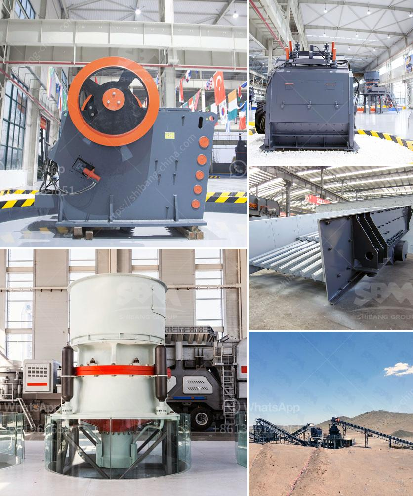

<h3>basalt crusher machine prices</h3>
Basalt is one of the popular materials for aggregate production. With its dark color and fine-grained texture, it is often used as a base material for constructing highways, gardens, and even buildings. Basalt is also known for its exceptional strength and durability, making it ideal for creating long-lasting structures.

To crush basalt efficiently, we need to choose the right basalt crusher machine that can fully meet the requirements of basalt processing. So, what are the factors that affect the price of basalt crusher machines?

Firstly, the capacity of the machine. The capacity refers to the maximum production output that the crusher machine can achieve per unit time. Generally, the higher the capacity, the higher the price of the machine. This is because high-capacity machines require more advanced technology and higher quality materials to ensure efficient performance and durability. Therefore, if you need a higher capacity basalt crusher machine, you should expect to pay a higher price.

Secondly, the technical specifications of the machine. Different machines may have different technical specifications, such as the size of the inlet, the size of the outlet, the power consumption, etc. These specifications can affect the overall performance and efficiency of the machine. Machines with more advanced technologies and better specifications tend to have higher prices. However, it is important to note that not all technical specifications are necessary for every application. Therefore, it is crucial to choose a machine that suits your specific needs and budget.

Thirdly, the brand reputation. The reputation of the brand manufacturing the crusher machine can also affect its price. Well-established and reputable brands tend to offer higher quality machines with better performance and durability. These machines may come with a higher price tag, but they are often worth the investment due to their reliability and long lifespan. On the other hand, lesser-known brands or manufacturers may offer cheaper options, but they may compromise on the quality and performance of the machine.

Lastly, the after-sales service and support. The availability of after-sales service and support is an important consideration when purchasing a basalt crusher machine. Machines may require maintenance, repairs, or even replacement parts over time. Brands that offer comprehensive after-sales service and support can provide peace of mind to the customers, as they know that any issues or concerns will be addressed promptly and professionally. Such after-sales service may come with an additional cost, but it is an important factor to consider for long-term satisfaction and reliability.

In conclusion, the price of a basalt crusher machine depends on various factors, such as the capacity, technical specifications, brand reputation, and after-sales service. It is important to carefully evaluate these factors and choose a machine that suits your specific needs and budget. Investing in a high-quality and reliable machine will ensure efficient performance and long-lasting durability, ultimately saving you time and money in the long run.
<h3>Contact us</h3><ul><li><strong>Whatsapp:&nbsp;<a href="https://wa.me/8613661969651">+8613661969651</a></strong></li><li><a href="https://swt.shibang-china.com/?git&amp;zhl&amp;basalt crusher machine prices"><strong>Online Service(chat now)</strong></a></li></ul><h3>Related</h3><ul><li><a href='dolomite to gypsum plants in south africa.md'>dolomite to gypsum plants in south africa</a></li><li><a href='advances in hammer mills.md'>advances in hammer mills</a></li><li><a href='rock crushing plant capacity 250 tph.md'>rock crushing plant capacity 250 tph</a></li><li><a href='limestone crushing processing for the manufacturer.md'>limestone crushing processing for the manufacturer</a></li><li><a href='pe series jaw crusher rate 1000ton per hour.md'>pe series jaw crusher rate 1000ton per hour</a></li></ul>