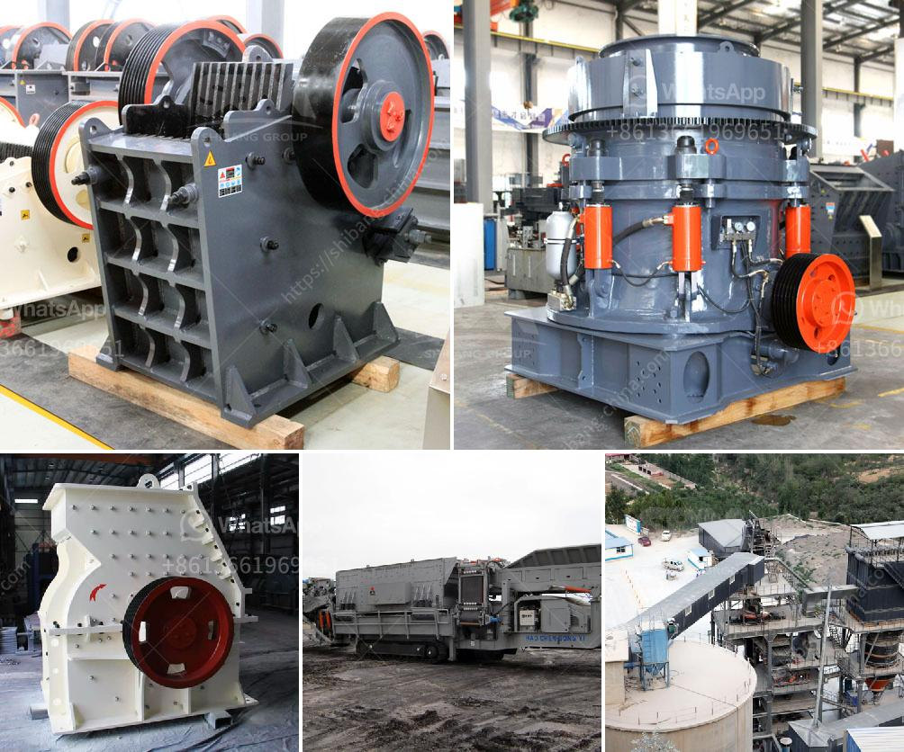

<h3>basalt crushing processing</h3>
Basalt is a hard and tough material with a high silicon content, which makes it difficult to crush and process. However, due to its excellent properties such as wear resistance, high temperature resistance, corrosion resistance, low water absorption, and electrical insulation, basalt has become an ideal choice for industrial applications, especially in the construction and road building industries.

The process of basalt crushing is consistent with other crushing operations involving tough and abrasive materials. The first stage of the process is the primary crushing phase, where huge rocks are crushed into smaller stones that fit the desired size. Jaw crushers are commonly used for this stage. These machines have a sturdy construction and are designed to handle even the toughest materials. They use a compressive force to crush the rocks against a fixed jaw plate, reducing them to a size suitable for further processing.

After primary crushing, the crushed basalt stones are sent to a secondary crushing stage, usually conducted by cone crushers or impact crushers. These machines have a high reduction ratio, ensuring the production of fine-sized aggregates. The cone crushers work by squeezing the material between an eccentrically rotating mantle and a concave, while the impact crushers use the principle of impact to crush the stones against a stationary plate. Both options are effective in producing well-shaped and evenly graded aggregates.

Next, the crushed basalt is screened into different sizes using vibrating screens. This step is crucial to separate the desired sizes and remove any oversize or undersize materials. The screened aggregates are then stored in stockpiles or loaded onto trucks for transportation to the desired location.

In addition to the crushing and screening process, basalt can also undergo further processing to meet specific requirements. For example, if the basalt is used for concrete production, it may be necessary to crush it into even smaller sizes or use special crushers designed for producing fine aggregates. The basalt can also be processed into asphalt mixtures for road construction or used as a base material for railway ballast.

To ensure efficient basalt crushing and processing, it is important to choose the right equipment. High-quality crushers and screens are essential for the smooth operation of the crushing plant. Additionally, regular maintenance and inspections are crucial to prevent any unexpected breakdowns or delays in production. It is also important to consider environmental factors and implement proper dust control measures to minimize the impact on the surrounding environment.

In conclusion, basalt crushing and processing is a complex and challenging process. However, with the right equipment and careful planning, it can be efficiently carried out to produce high-quality aggregates for various industrial applications. By understanding the properties of basalt and implementing the appropriate crushing and screening techniques, the potential of this versatile material can be fully realized.
<h3>Contact us</h3><ul><li><strong>Whatsapp:&nbsp;<a href="https://wa.me/8613661969651">+8613661969651</a></strong></li><li><a href="https://swt.shibang-china.com/?git&amp;zhl&amp;basalt crushing processing"><strong>Online Service(chat now)</strong></a></li></ul><h3>Related</h3><ul><li><a href='machines used stone crusher vancouver.md'>machines used stone crusher vancouver</a></li><li><a href='wet process of cement.md'>wet process of cement</a></li><li><a href='price of stone crusher.md'>price of stone crusher</a></li><li><a href='super fine powder grinder.md'>super fine powder grinder</a></li><li><a href='slag grinding machine.md'>slag grinding machine</a></li></ul>