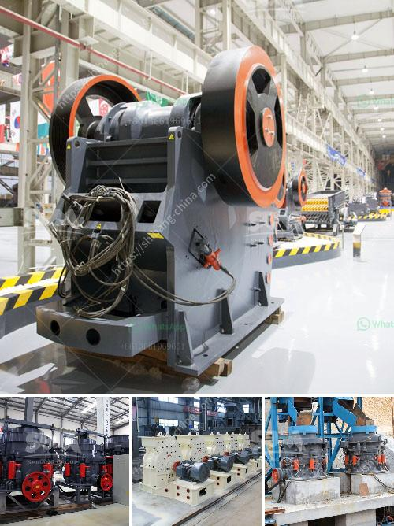

<h3>basalt crushing production line</h3>
Basalt is a basic volcanic rock material belonging to the dark volcanic rock family. It is mainly composed of basic plagioclase, pyroxene, and olivine. It is a common material used in roads, railways, and other infrastructure projects. With the continuous development of infrastructure construction, the demand for basalt gradually increases, and the market prospect of basalt is broad. Therefore, the basalt crushing production line is a promising industry.

Basalt crushing production line is mainly composed of vibrating feeder, jaw crusher, impact crusher, cone crusher, VSI crusher, circular vibrating screen, belt conveyor and other equipment. Among them, the impact crusher and cone crusher play a role in secondary crushing equipment in the whole production process.

The basalt crushing production line is suitable for the application of water and electricity, building materials, highways, urban construction and other industries. The customer has been satisfied with the efficiency of the equipment provided by Dongmeng Machinery.

The core equipment of the whole production line is Dongmeng Machinery's PEW860 European jaw crusher and PFW1315 European impact crusher. During the production process, various equipment is reasonably matched, which perfectly integrates the overall operation and effectively guarantees the efficient production of the entire basalt crushing production line. The finished product produced by the equipment has good grain shape, uniform particle size, and high economic value.

The vibrating feeder is responsible for the feeding and conveying of materials. It adopts a double eccentric shaft vibration exciter to ensure stable operation and smooth feeding, providing a continuous and uniform feeding for the subsequent crushing equipment.

The jaw crusher is an important primary crushing equipment for crushing various ores and bulk materials. It has a large crushing ratio and strong crushing capacity, and is widely used in mining, smelting, building materials, highways, railways, water conservancy and chemical industries.

The impact crusher is a secondary crushing equipment. It uses impact energy to crush materials, which can effectively reduce the loss of wear-resistant parts. It has the advantages of large crushing ratio, high crushing efficiency, cubic shape of finished products, adjustable product size, and simplified crushing process.

The cone crusher is another important secondary crushing equipment. It adopts laminated crushing principle to crush materials, and the crushed materials are cubic particles. The cone crusher has the advantages of reliable structure, high production efficiency, convenient adjustment, and low operating cost.

The circular vibrating screen is used for screening and grading the crushed materials, and the materials with different particle sizes are classified into different specifications.

The belt conveyor is responsible for the transportation of materials in the production process, which greatly improves the work efficiency and reduces the labor intensity of workers.

In summary, the basalt crushing production line is a promising industry with unlimited potential. Dongmeng Machinery has been committed to the research and development of advanced crushing technology for many years, and has accumulated rich experience in the production of crushing equipment. The basalt crushing production line provided by Dongmeng Machinery has high degree of automation, low operation cost, large crushing ratio, uniform product particle size, and good grain shape, which meets the requirements of various applications in the construction field. It has been widely recognized and praised by customers at home and abroad. In the future, with the continuous improvement of crushing technology, the basalt crushing production line will have more diversified equipment and better development prospects.
<h3>Contact us</h3><ul><li><strong>Whatsapp:&nbsp;<a href="https://wa.me/8613661969651">+8613661969651</a></strong></li><li><a href="https://swt.shibang-china.com/?git&amp;zhl&amp;basalt crushing production line"><strong>Online Service(chat now)</strong></a></li></ul><h3>Related</h3><ul><li><a href='super fine powder grinder.md'>super fine powder grinder</a></li><li><a href='three ring micro powder mill.md'>three ring micro powder mill</a></li><li><a href='cs cone crusher.md'>cs cone crusher</a></li><li><a href='ball mill capacity tons.md'>ball mill capacity tons</a></li><li><a href='conveyor belt laying procedure.md'>conveyor belt laying procedure</a></li></ul>