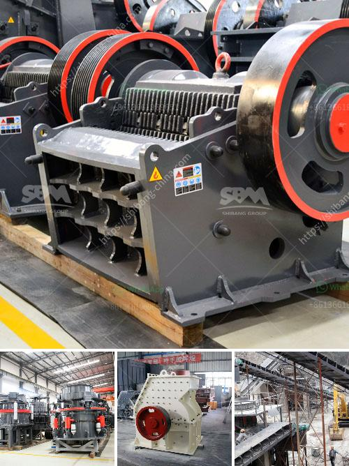

<h3>basalt production plant</h3>
Basalt is a type of volcanic rock that is known for its durability and strength, making it a popular material for construction and infrastructure projects. As the demand for this versatile material continues to grow, the establishment of a basalt production plant becomes crucial to meet the market's needs.

A basalt production plant is a facility where basalt rocks are crushed, heated, and converted into several different products that cater to various industries. The process starts with the extraction of basalt rocks from quarries. These rocks are then crushed to smaller sizes using crushers, resulting in different grades of basalt aggregate.

Once crushed, the basalt rocks are heated in a kiln at high temperatures. This process, known as basalt fiberization, allows the rocks to melt and transform into molten lava. The molten lava is then extruded through spinnerets, creating basalt fibers. These fibers are exceptionally durable and have impressive mechanical properties, including high tensile strength and excellent resistance to chemicals and fire.

The basalt fibers produced in the plant can be further processed into various products, such as basalt rebar, basalt mesh, basalt fabrics, and basalt composites. Basalt rebar, for instance, is an alternative to traditional steel reinforcement, offering superior strength and corrosion resistance. Basalt mesh and fabrics find applications in the construction of roadways, bridges, and buildings, providing effective reinforcement and longevity.

Establishing a basalt production plant requires careful planning and consideration. Factors such as site selection, environmental impact assessment, investment in state-of-the-art machinery, and adherence to safety regulations are crucial for the successful operation of the plant.

With the increasing demand for basalt-based products in the construction and infrastructure sectors, a basalt production plant plays a vital role in ensuring a steady supply of high-quality materials. This not only caters to the growing needs of the market but also contributes to sustainable development by providing a durable and eco-friendly alternative to traditional construction materials.
<h3>Contact us</h3><ul><li><strong>Whatsapp:&nbsp;<a href="https://wa.me/8613661969651">+8613661969651</a></strong></li><li><a href="https://swt.shibang-china.com/?git&amp;zhl&amp;basalt production plant"><strong>Online Service(chat now)</strong></a></li></ul><h3>Related</h3><ul><li><a href='artificial stone production line.md'>artificial stone production line</a></li><li><a href='consol glass recycling price list south africa.md'>consol glass recycling price list south africa</a></li><li><a href='cost of converyer belts in south africa.md'>cost of converyer belts in south africa</a></li><li><a href='price crusher mill price stone crusher.md'>price crusher mill price stone crusher</a></li><li><a href='crusher machine south africa.md'>crusher machine south africa</a></li></ul>