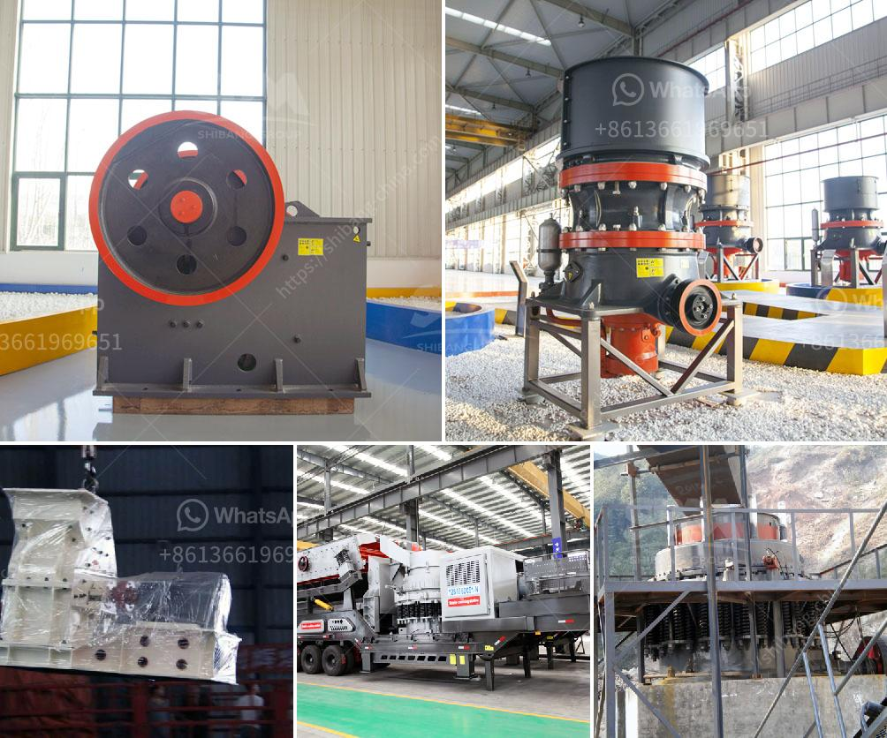

<h3>basin a grinding roller mill</h3>
Grinding mills are essential equipment in various industries, enabling the processing and grinding of raw materials into finer particles. One such advancement in grinding technology is the introduction of the basin a grinding roller mill. This innovative machine offers an efficient and reliable solution for various grinding needs.

The basin a grinding roller mill is equipped with a unique design that maximizes grinding efficiency. Its key component is the grinding roller, which is responsible for grinding the raw materials. This roller is made of high-quality materials that ensure durability and longevity, even under heavy usage. The shape and size of the roller are carefully optimized to provide maximum contact area with the grinding surface, resulting in more efficient grinding.

In addition to its high grinding efficiency, the basin a grinding roller mill also boasts a compact size. Unlike traditional grinding mills that occupy a significant amount of space, this modern machine is designed to fit into smaller areas without sacrificing production capacity. This compact design allows for easy installation and integration into existing production lines, making it a cost-effective choice for many industrial facilities.

Furthermore, the basin a grinding roller mill offers enhanced safety features. It is equipped with advanced sensors and controls that monitor and regulate the grinding process. These features ensure that the machine operates within safe parameters and minimizes the risk of accidents or damage. This makes it suitable for use in various industries, including mining, cement production, and chemical processing.

The basin a grinding roller mill also offers versatility in terms of the materials it can process. It is suitable for grinding a wide range of materials, including minerals, ores, and various industrial raw materials. Its flexibility makes it an ideal choice for businesses that deal with diverse materials and need a reliable grinding solution.

In conclusion, the basin a grinding roller mill is a valuable innovation in grinding technology. With its high grinding efficiency, compact design, enhanced safety features, and versatility, it offers a reliable and efficient solution for various grinding needs in industries worldwide. This machine is set to revolutionize the grinding equipment market, providing efficient and sustainable solutions for businesses across diverse sectors.
<h3>Contact us</h3><ul><li><strong>Whatsapp:&nbsp;<a href="https://wa.me/8613661969651">+8613661969651</a></strong></li><li><a href="https://swt.shibang-china.com/?git&amp;zhl&amp;basin a grinding roller mill"><strong>Online Service(chat now)</strong></a></li></ul><h3>Related</h3><ul><li><a href='ball mill for silica grinding made in japan.md'>ball mill for silica grinding made in japan</a></li><li><a href='size of balls in ball mill.md'>size of balls in ball mill</a></li><li><a href='chrome ore washing plant.md'>chrome ore washing plant</a></li><li><a href='mobile mini crusher hire.md'>mobile mini crusher hire</a></li><li><a href='silica sand beneficiation plant for glass.md'>silica sand beneficiation plant for glass</a></li></ul>