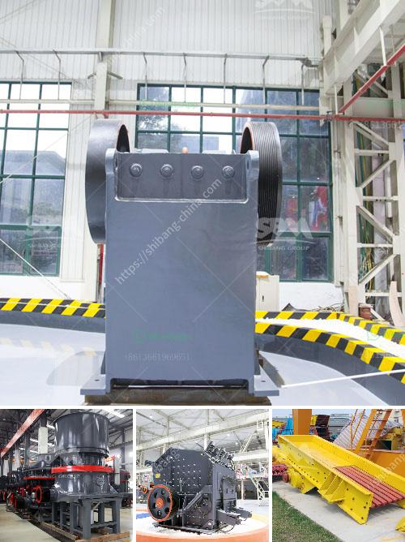

<h3>bauxite crusher design</h3>
Bauxite is a mineral that is primarily used as an aluminum ore, and crusher designs have undergone significant improvements over the years to optimize the extraction and refining processes for the production of aluminum. Bauxite crushers are used to crush bauxite ore into small particles for easier transportation to refining facilities. The global demand for aluminum has increased considerably, and bauxite crusher designs have been adapted to meet this growing demand.

One of the key factors driving the evolution of bauxite crusher designs is the need to enhance the efficiency of the extraction process. A common method of extracting aluminum from bauxite ore involves a three-stage crushing process, which requires the use of specific types of crushers. In the first stage, a jaw crusher is used to crush the bauxite ore into smaller particles that are then conveyed to a secondary crusher. In the second stage, a Cone crusher is used to further reduce the size of the bauxite particles before being conveyed to the refining facility.

The development of bauxite crusher designs has sought to optimize the particle size distribution, minimize fines generation, and maximize the production of alumina. Bauxite crusher designs are often accompanied by Rotary Dryers to facilitate the drying process, so that the final product can be fed into a Ball Mill for further refining.

The bauxite crusher design should be optimized to focus on minimizing maintenance costs and maximizing availability. In addition to the three primary stages, jaw crushers are usually used as primary crushers in the fourth stage, which involves the reduction of larger bauxite pieces into smaller particles. This is crucial to ensure that the overall extraction and refining processes are conducted efficiently.

Furthermore, bauxite crusher designs need to facilitate easy maintenance, as regular maintenance is essential to ensure the longevity and efficiency of the equipment. The crusher should be equipped with easy-to-access cleaning and maintenance points, as well as replaceable wear parts, to minimize downtime and ensure maximum productivity.

In terms of safety considerations, bauxite crusher designs should incorporate features that prevent the accidental entry of foreign materials or irregularly sized particles into the crushing chamber. This can be achieved through the installation of metal detectors or the use of specially designed grates. Additionally, emergency stop buttons and clear warning signs should be readily accessible to operators to ensure their safety.

Overall, bauxite crusher designs are continually evolving to meet the increasing demands of the aluminum industry. The focus is on maximizing efficiency, reducing maintenance costs, and ensuring the safety of operators. With technological advancements, bauxite crushers now have improved capabilities to produce high-quality alumina, which is essential for the global aluminum market. The design of bauxite crushers plays a critical role in the extraction and refining processes, and manufacturers continue to innovate to ensure that these crushers are efficient, reliable, and safe.
<h3>Contact us</h3><ul><li><strong>Whatsapp:&nbsp;<a href="https://wa.me/8613661969651">+8613661969651</a></strong></li><li><a href="https://swt.shibang-china.com/?git&amp;zhl&amp;bauxite crusher design"><strong>Online Service(chat now)</strong></a></li></ul><h3>Related</h3><ul><li><a href='about aggregate crusher plants.md'>about aggregate crusher plants</a></li><li><a href='mobile crushing machine manufacturer.md'>mobile crushing machine manufacturer</a></li><li><a href='hammer mill for clay.md'>hammer mill for clay</a></li><li><a href='used excavators prices in uae.md'>used excavators prices in uae</a></li><li><a href='aggregates crusher philippines.md'>aggregates crusher philippines</a></li></ul>