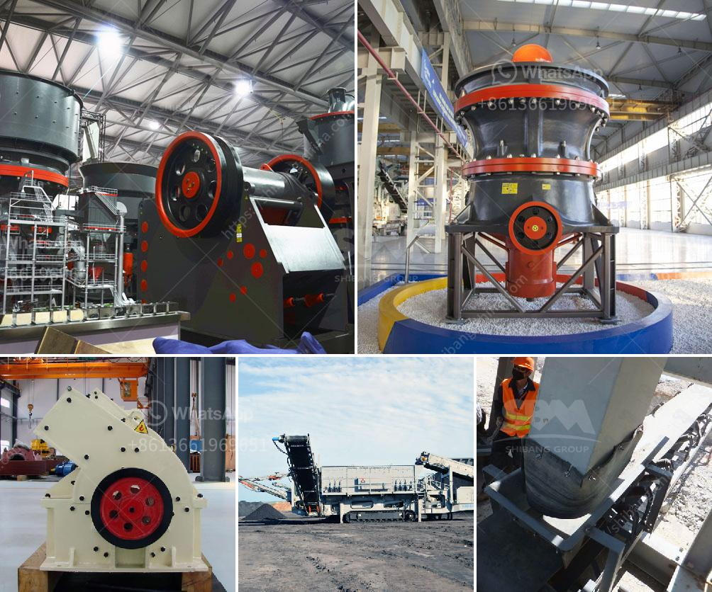

<h3>bauxite crusher equipment</h3>
Bauxite is a common natural ore with a wide range of uses in various industries. As an important refining aluminum ore, bauxite is widely used in aluminum smelting, precision casting, refractory products, and other fields. With the rapid development of the aluminum industry, the demand for bauxite is constantly increasing, and the market for bauxite crushers is also developing rapidly.

The crushing process plays an important role in the production of bauxite. It is known that bauxite is mainly extracted from ores in high temperatures and high pressures. The bauxite needs to be processed into small particles for further usage. For this reason, bauxite crusher equipment is indispensable.

Bauxite crusher equipment is equipped with advanced technology, with hydraulic adjustment and centralized automatic lubrication system. It not only assures the stable operation but also makes the maintenance more convenient. High-efficiency bauxite crusher equipment manufacturer aims to produce the most efficient and cost-effective crushing equipment to meet the market demands.

Based on many years of experience in the industry, we have conducted extensive research and development to design a high-efficiency bauxite crusher machine, which specifically targets large-scale projects and solves the bottleneck problem in traditional crushers. It adopts the principle of continuous crushing, so that the product size is more uniform, and the energy consumption is lower.

In addition, the bauxite crusher equipment produced by our company is made of high-quality materials, with wear resistance and long service life, which can effectively reduce the investment cost of customers and improve the economic benefits. With the continuous development of the market, we will continue to innovate and improve our equipment to meet the needs of customers.

In conclusion, bauxite crusher equipment plays an important role in the bauxite crushing process. The high-efficiency and cost-effective performance of the equipment can effectively improve the economic benefits of users. As a professional supplier of bauxite crusher equipment, we will continue to innovate and improve our equipment to provide customers with satisfactory products and services.
<h3>Contact us</h3><ul><li><strong>Whatsapp:&nbsp;<a href="https://wa.me/8613661969651">+8613661969651</a></strong></li><li><a href="https://swt.shibang-china.com/?git&amp;zhl&amp;bauxite crusher equipment"><strong>Online Service(chat now)</strong></a></li></ul><h3>Related</h3><ul><li><a href='quarry business cost in india.md'>quarry business cost in india</a></li><li><a href='crusher manufacturers in saudi.md'>crusher manufacturers in saudi</a></li><li><a href='ball mill in zimbabwe for sale.md'>ball mill in zimbabwe for sale</a></li><li><a href='vertical roller mill industrial.md'>vertical roller mill industrial</a></li><li><a href='hydraulic system loesche mill.md'>hydraulic system loesche mill</a></li></ul>