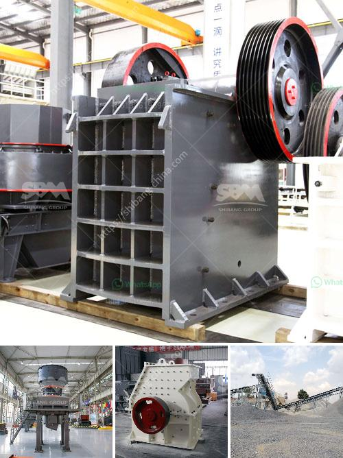

<h3>bauxite crusher for sale</h3>
Bauxite is a mineral found mostly in a belt around the equator. It is the principal ore of aluminum and is widely used in the production of various products such as cement, ceramics, refractory materials, and more. Bauxite is considered to be one of the world's most significant economic minerals due to its abundance and high demand.

In order to extract aluminum from bauxite, it needs to be processed through a series of crushers. One such crusher is the bauxite crusher for sale. It is designed to reduce large rocks into smaller ones and produce gravel or rock dust for further applications. This machine features a rotating cylinder with steel jaws that crush material against the fixed jaw.

The bauxite crusher for sale is developed based on the traditional jaw crusher. It takes the advantages of simple structure, high capacity and low energy consumption. It has been a popular crusher for crushing bauxite ore in mining operations.

The bauxite crusher for sale produced by SBM Machinery consists of various types, such as jaw crusher, impact crusher, cone crusher, hammer crusher and other types. They mainly differ in size, capacity, and output size. The larger size crushers are capable of breaking bauxite into lumps that are then used in various industrial applications.

With the increasing demand for aluminum, the need for bauxite crushers will continue to rise. The bauxite crusher for sale not only improves the production efficiency but also reduces the investment cost. With the economic globalization, the market demand for bauxite crusher is expanding.

In conclusion, the bauxite crusher for sale is critical for bauxite mining. It is essential to choose the suitable crusher machine in order to ensure the high-quality end product. For more information about SBM Machinery's bauxite crusher for sale, please feel free to contact us.
<h3>Contact us</h3><ul><li><strong>Whatsapp:&nbsp;<a href="https://wa.me/8613661969651">+8613661969651</a></strong></li><li><a href="https://swt.shibang-china.com/?git&amp;zhl&amp;bauxite crusher for sale"><strong>Online Service(chat now)</strong></a></li></ul><h3>Related</h3><ul><li><a href='construction hammer mill.md'>construction hammer mill</a></li><li><a href='list mining equipments are used in granite quarries.md'>list mining equipments are used in granite quarries</a></li><li><a href='advances in hammer mills.md'>advances in hammer mills</a></li><li><a href='conveyor for sale in malaysia.md'>conveyor for sale in malaysia</a></li><li><a href='limestone crushing processing for the manufacturer.md'>limestone crushing processing for the manufacturer</a></li></ul>