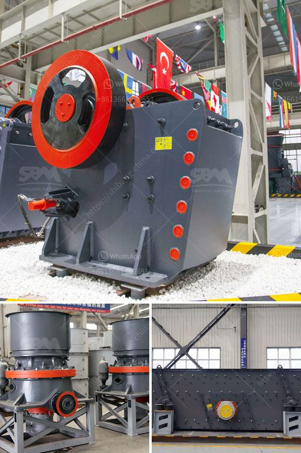

<h3>bauxite crusher manufacturer in china mill gold</h3>
Bauxite, considered as an important ore for aluminum production, has always been the backbone of China's economic development. Bauxite crusher manufacturer in China, mill gold, believes that adding value to the product and the brand will be more favored by users. With the rapid development of China's industrialization and urbanization, the demand for aluminum products is increasing, which has driven the continuous expansion of the bauxite market.

As a professional manufacturer of bauxite crushers in China, mill gold has been focusing on technological innovation and product improvement to meet the growing market demand. The high-quality bauxite crushers produced by mill gold are not only widely used in various mining industries, but also highly acclaimed by users for their excellent performance.

The bauxite crusher produced by mill gold adopts advanced manufacturing technology and high-quality materials to ensure its long service life and reliable performance. It has the advantages of large crushing ratio, high production efficiency, low energy consumption, and uniform product size. In addition, the bauxite crusher is equipped with a hydraulic system, which can quickly adjust the discharge port to control the size of the final product.

Furthermore, as a customer-oriented manufacturer, mill gold not only provides high-quality bauxite crushers but also offers complete after-sales service and strong technical support. Their professional technicians can provide on-site installation guidance and technical training to ensure that customers can quickly put the equipment into production.

In conclusion, as the demand for aluminum products continues to rise, the bauxite crusher manufacturer in China, mill gold, plays a crucial role in satisfying the market demand. With its high-quality products, advanced technology, and excellent service, mill gold has become the preferred choice of many users. In the future, mill gold will continue to uphold the principle of customer first and strive to provide more efficient and reliable equipment to contribute to the sustainable development of China's bauxite industry.
<h3>Contact us</h3><ul><li><strong>Whatsapp:&nbsp;<a href="https://wa.me/8613661969651">+8613661969651</a></strong></li><li><a href="https://swt.shibang-china.com/?git&amp;zhl&amp;bauxite crusher manufacturer in china mill gold"><strong>Online Service(chat now)</strong></a></li></ul><h3>Related</h3><ul><li><a href='principle of jaw crusher operation.md'>principle of jaw crusher operation</a></li><li><a href='stone crusher finding.md'>stone crusher finding</a></li><li><a href='gypsum making machine india.md'>gypsum making machine india</a></li><li><a href='rock crusher plant cost.md'>rock crusher plant cost</a></li><li><a href='m sand manufacturing process.md'>m sand manufacturing process</a></li></ul>