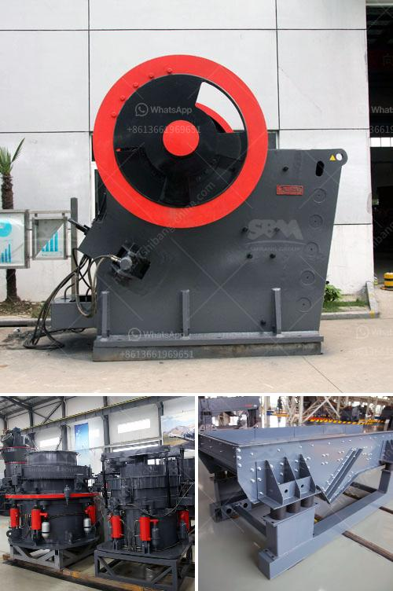

<h3>bauxite crusher plant construction</h3>
Bauxite is a rock composed mainly of aluminum oxide and aluminum hydroxide minerals. It forms when laterite soil is leached of its minerals and the remaining minerals are enriched in bauxite. It is typically found in tropical or subtropical regions, making it an abundant and essential resource for the production of aluminum.

The process of extracting aluminum from bauxite involves crushing, grinding, and refining through various methods. A bauxite crusher plant is a machine designed to reduce the size of bauxite ore in preparation for refining or extracting aluminum. The crushing plant is composed of a primary crusher, such as a jaw crusher, followed by a cone crusher to reduce the run-of-mine bauxite to the desired fineness. Further, the crushed bauxite can be transported to a secondary or tertiary crushing plant for further size reduction.

The use of a crusher plant offers significant benefits to the construction and mining industries, including increased efficiency, savings in energy consumption, and reduced environmental impact. By reducing the size of the bauxite ore before refining, less energy is required during the extraction process, resulting in reduced greenhouse gas emissions and a lower carbon footprint.

Furthermore, the construction of a bauxite crusher plant promotes job creation and local economic development. The construction phase requires skilled workers, engineers, and support staff, contributing to employment opportunities in the area. Once operational, the plant provides a reliable source of bauxite for aluminum production, which, in turn, supports downstream industries like manufacturing, construction, and transportation. This further stimulates economic activity and regional growth.

When designing a bauxite crusher plant, several factors need to be considered to ensure the plant meets the desired production capacity, quality requirements, and environmental regulations. These factors include the hardness and abrasiveness of the bauxite ore, the required size reduction ratio, the availability and cost of energy, the accessibility of water sources, and the transportation logistics for raw materials and finished products.

In addition, safety measures and noise reduction strategies must be implemented to protect workers and minimize environmental impact. Adequate dust control systems should also be installed to prevent air pollution and protect nearby communities and ecosystems.

The construction of a bauxite crusher plant involves the coordination of multiple stakeholders, including government agencies, mining companies, contractors, and local communities. Transparent communication and consultation with all parties are crucial to address potential concerns, ensure compliance with regulations, and foster positive relationships.

In conclusion, the construction of a bauxite crusher plant plays a vital role in the mining and manufacturing industries. It enhances efficiency, reduces energy consumption, promotes economic growth, and supports sustainable development. By adhering to best practices, such as environmental protection and stakeholder engagement, the construction and operation of a bauxite crusher plant can be a responsible and beneficial endeavor.
<h3>Contact us</h3><ul><li><strong>Whatsapp:&nbsp;<a href="https://wa.me/8613661969651">+8613661969651</a></strong></li><li><a href="https://swt.shibang-china.com/?git&amp;zhl&amp;bauxite crusher plant construction"><strong>Online Service(chat now)</strong></a></li></ul><h3>Related</h3><ul><li><a href='small cement grinding plant.md'>small cement grinding plant</a></li><li><a href='stone crusher sri lanka.md'>stone crusher sri lanka</a></li><li><a href='marble processing machines.md'>marble processing machines</a></li><li><a href='mobile crusher supplier.md'>mobile crusher supplier</a></li><li><a href='tanzania gold crusher price.md'>tanzania gold crusher price</a></li></ul>