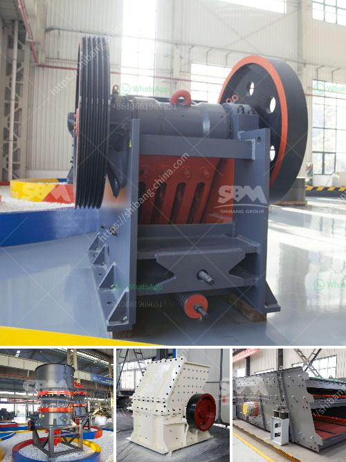

<h3>bauxite from cement plants in india</h3>
India has been witnessing rapid infrastructure development and urbanization in recent years. As the country continues to build new roads, bridges, buildings, and other structures, the demand for cement has skyrocketed. Cement, a crucial component of construction, is the binding agent that holds together various materials like sand, gravel, and limestone. However, one vital ingredient that often gets overlooked is bauxite.

Bauxite is a sedimentary rock that is the primary source of aluminum. It is widely used in different industries, including the cement manufacturing sector. The production of cement involves numerous steps, and each requires specific raw materials for a quality end product. Bauxite plays a crucial role in cement manufacturing, primarily in the production of clinker, a key component of cement.

The process of producing cement starts with mining limestone, which is the primary raw material. Once mined, limestone is crushed and mixed with other additives, including iron ore and bauxite, to create a powder called raw meal. This raw meal is then fed into a kiln, where it undergoes a high-temperature pyroprocessing. During this process, bauxite acts as a fluxing agent, helping to maintain the necessary chemical balance in the kiln.

One of the key reasons why bauxite is preferred in cement manufacturing is its alumina content. Alumina, derived from bauxite, imparts certain properties to cement, increasing its strength and durability. Bauxite also contributes to the formation of calcium aluminate phases, which are essential for the hydration process of cement. Additionally, the use of bauxite helps to reduce the overall energy consumption during the pyroprocessing stage.

India is the world's sixth-largest producer of bauxite ore, with significant reserves concentrated in the states of Odisha, Andhra Pradesh, and Gujarat. The country's cement industry heavily relies on domestic bauxite production, ensuring a steady supply of this critical raw material. Several cement plants in India have bauxite mines within close proximity, reducing transportation costs and ensuring a consistent supply chain.

Moreover, the Indian government has taken measures to promote the mining and extraction of bauxite to meet the growing demands of the cement industry. Organizations like the Geological Survey of India (GSI) play a crucial role in identifying potential bauxite-rich areas and ensuring the sustainable exploration of these resources. This focus on domestic bauxite production helps reduce dependency on imports, making India self-reliant and resilient in the face of global supply chain disruptions.

However, the environmental impact of bauxite mining should not be overlooked. Mining activities, if not properly regulated, can lead to deforestation, habitat destruction, and soil erosion. It is crucial for responsible mining practices to be implemented, considering the long-term sustainability of bauxite extraction.

In conclusion, bauxite is an essential raw material in the cement manufacturing process in India. Its alumina content enhances the properties of cement and reduces energy consumption. With significant domestic reserves and a focus on sustainable mining, India's cement industry can rely on consistent bauxite supply from cement plants located close to bauxite mines. However, environmental concerns must be addressed to ensure responsible mining practices and minimize the ecological impact. The continued production and availability of bauxite will ensure India's infrastructure growth and cement industry development in the coming years.
<h3>Contact us</h3><ul><li><strong>Whatsapp:&nbsp;<a href="https://wa.me/8613661969651">+8613661969651</a></strong></li><li><a href="https://swt.shibang-china.com/?git&amp;zhl&amp;bauxite from cement plants in india"><strong>Online Service(chat now)</strong></a></li></ul><h3>Related</h3><ul><li><a href='dolomite production plant.md'>dolomite production plant</a></li><li><a href='production of cement in guinee.md'>production of cement in guinee</a></li><li><a href='belt conveyor level.md'>belt conveyor level</a></li><li><a href='copper ore crushing machinery.md'>copper ore crushing machinery</a></li><li><a href='roller crusher equipment manufacturer.md'>roller crusher equipment manufacturer</a></li></ul>