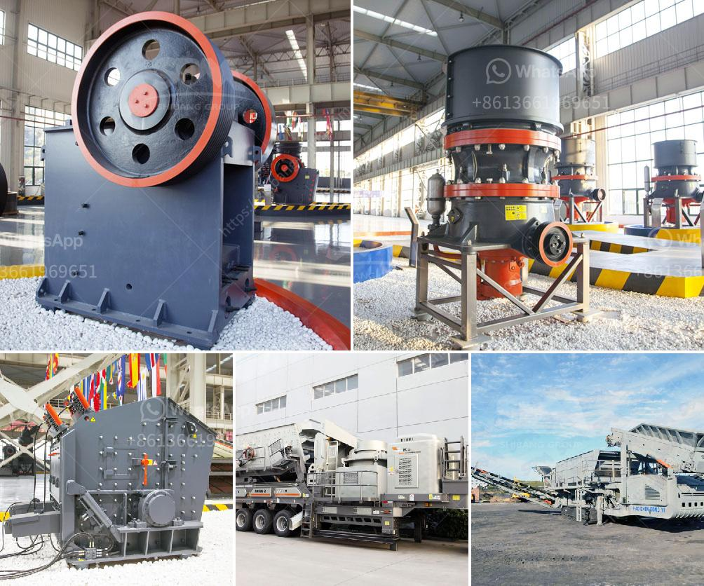

<h3>bauxite processing plant project cost</h3>
Bauxite is the primary ore of aluminum, which is used to make a variety of products ranging from aircraft parts to household appliances. The process for extracting aluminum from bauxite ore involves crushing, screening, washing, grinding, and refining. This will ultimately result in an alumina (aluminum oxide) substance, from which aluminum can be smelted.

One crucial aspect of setting up a bauxite processing plant is the cost of the project. This cost includes the purchase and installation of machinery, any necessary infrastructure, and the cost of labor. Additionally, operational costs such as energy and water consumption, waste management, and transportation must also be accounted for.

The project cost for a bauxite processing plant can vary considerably depending on the proposed capacity and desired end product specifications. As a general rule, a smaller scale plant with a processing capacity of around 200,000-300,000 metric tons per year will require a lower initial investment compared to a larger scale plant with a capacity of 500,000+ tons per year.

The machinery required for a bauxite processing plant typically includes crushers, mills, conveyors, vibrating screens, and a range of ancillary equipment. The cost of these machinery items can vary depending on their size, quality, and manufacturer. It is crucial to carefully consider the specifications and performance requirements of each machine before purchasing to ensure long-term reliability and efficiency.

Apart from machinery, other costs associated with a bauxite processing plant project include land acquisition, construction of buildings and storage facilities, installation of utilities such as electricity, water, and gas supply, and the implementation of safety measures and environmental regulations. These costs can add up significantly, especially when it comes to meeting strict environmental standards and ensuring the safety of workers.

Moreover, operational costs such as energy consumption also need to be taken into account. Processing bauxite into alumina requires a substantial amount of energy, mainly for grinding and refining. Minimizing energy consumption is not only a cost-saving measure but also an environmental concern. Investing in energy-efficient equipment and exploring alternative energy sources can help reduce operational costs in the long run.

Furthermore, waste management and transportation costs should be considered during the planning stage. Bauxite processing generates various types of waste, such as red mud and tailings, which require proper handling and disposal. These wastes often need to be transported to designated landfill areas or recycling facilities, which can incur additional costs. Implementing efficient waste management practices, such as recycling or reusing certain by-products, can mitigate waste disposal costs.

In conclusion, the project cost for a bauxite processing plant can vary depending on the scale, capacity, and desired end product specifications. The cost includes not only machinery purchase and installation but also infrastructure, labor, energy consumption, waste management, and transportation. Careful planning and consideration of these costs are crucial to ensure a successful and economically viable project.
<h3>Contact us</h3><ul><li><strong>Whatsapp:&nbsp;<a href="https://wa.me/8613661969651">+8613661969651</a></strong></li><li><a href="https://swt.shibang-china.com/?git&amp;zhl&amp;bauxite processing plant project cost"><strong>Online Service(chat now)</strong></a></li></ul><h3>Related</h3><ul><li><a href='small concrete crusher for sale.md'>small concrete crusher for sale</a></li><li><a href='to separate manganese and iron ore.md'>to separate manganese and iron ore</a></li><li><a href='mobile crushing price.md'>mobile crushing price</a></li><li><a href='primary crusher price in bolivia.md'>primary crusher price in bolivia</a></li><li><a href='grinding mill for limestone italy.md'>grinding mill for limestone italy</a></li></ul>