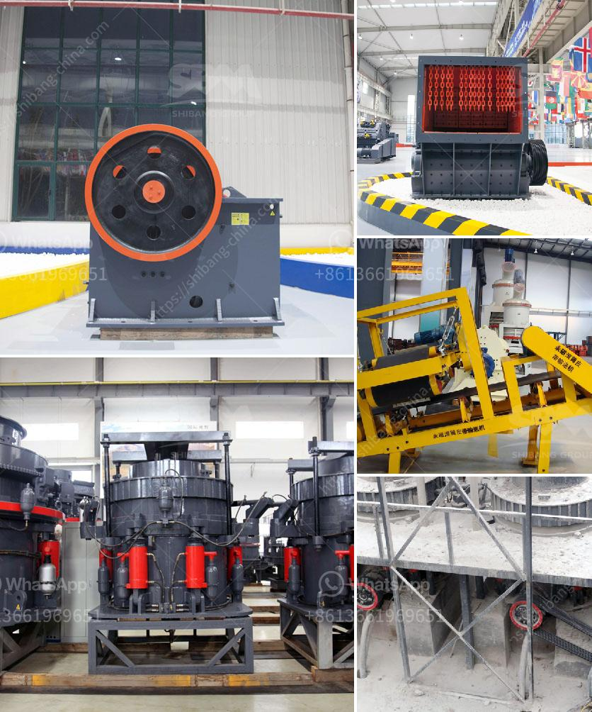

<h3>belt conveyor level</h3>
Belt conveyors have become a vital component of various industries, facilitating efficient movement of goods and materials. However, one often overlooked aspect of maintaining optimal conveyor performance is ensuring proper leveling. In this article, we will explore the significance of belt conveyor leveling and how it positively impacts productivity and efficiency.

One of the primary advantages of maintaining a level belt conveyor is the smooth and uninterrupted material flow it enables. By leveling the conveyor, the belt maintains a consistent height, preventing any potential obstructions or excessive inclinations that could impede the movement of materials. This undisturbed flow optimizes throughput and minimizes potential bottlenecks, resulting in increased productivity and reduced downtime.

A properly leveled belt conveyor also contributes to the longevity of the conveyor belt itself. An unevenly leveled conveyor can cause unnecessary strain on the belt, leading to premature wear and tear. By ensuring a level conveyor, the belt is allowed to operate evenly and symmetrically, reducing stress and extending its lifespan. This eliminates the need for frequent belt replacements, saving both time and money for businesses in the long run.

Unevenly leveled belt conveyors can create areas of low clearance which may lead to material spillage. These spillages not only result in cleanup costs but can also pose significant safety hazards in an industrial setting. A consistently leveled conveyor prevents potential accumulation points and allows materials to flow evenly without spillage. By maintaining a clean and safe work environment, overall efficiency is further improved.

In summary, belt conveyor leveling is a critical aspect of ensuring productivity and efficiency in various industries. It facilitates smooth material flow, extends belt lifespan, and prevents material spillage, resulting in improved operations.
<h3>Contact us</h3><ul><li><strong>Whatsapp:&nbsp;<a href="https://wa.me/8613661969651">+8613661969651</a></strong></li><li><a href="https://swt.shibang-china.com/?git&amp;zhl&amp;belt conveyor level"><strong>Online Service(chat now)</strong></a></li></ul><h3>Related</h3><ul><li><a href='stone grinding roller mill for sale.md'>stone grinding roller mill for sale</a></li><li><a href='quarry crusher for sale.md'>quarry crusher for sale</a></li><li><a href='limestone jaw crushers.md'>limestone jaw crushers</a></li><li><a href='stone crusher to make gravel.md'>stone crusher to make gravel</a></li><li><a href='crusher cost stone crusher peru cost.md'>crusher cost stone crusher peru cost</a></li></ul>