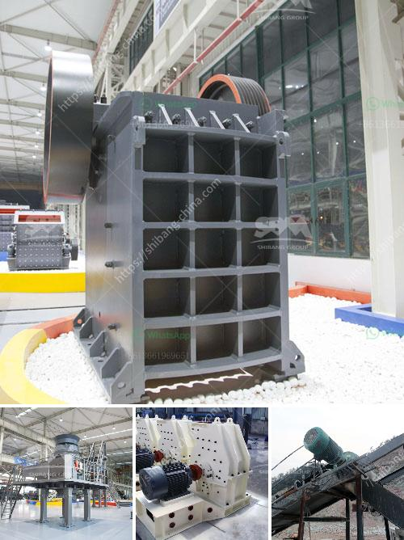

<h3>bentonite granuels machines gujrat</h3>
Bentonite granules are formed from a natural clay substance called bentonite. Bentonite is known for its unique ability to swell and absorb moisture, making it an ideal material for a variety of applications. In Gujarat, a state in western India, bentonite granules machines are widely used due to the abundance of bentonite and its favorable properties.

These machines are designed to turn the raw bentonite into granules, which can be used in numerous industries such as agriculture, pharmaceuticals, and chemical. The process of granulation involves several steps, starting with the preparation of the raw material. Bentonite is mined and then sun-dried to remove any excess moisture.

Once the raw material is ready, it is crushed into small particles using crushers or pulverizers. The crushed bentonite is then mixed with a binder, usually a liquid such as water or oil, to form a granular mass. This mixture is fed into the granulation machine, where it is further compacted and shaped into spherical granules.

In Gujarat, there are several manufacturers and suppliers of bentonite granules machines. These machines are made with high-quality materials and advanced technology to ensure efficient and precise granulation. The machines come in different sizes and capacities to cater to the specific requirements of different industries.

One of the key advantages of using bentonite granules machines is their ability to control granule size and shape. This is crucial, as different applications require granules of specific dimensions. The machines are equipped with screens and sieves that allow for precise control over the size distribution of the granules.

Another advantage of using these machines is their high production capacity. They can process large quantities of raw material within a short period, ensuring a steady supply of bentonite granules. This is particularly important in industries that require a consistent and reliable source of granules for their operations.

Moreover, bentonite granules machines in Gujarat are designed to be energy-efficient and environmentally friendly. They are equipped with various mechanisms and systems that minimize energy consumption and waste generation. This aligns with the global trend towards sustainable manufacturing practices and reduces the carbon footprint of the bentonite industry.

In addition to their production capabilities, these machines also offer ease of operation and maintenance. They are designed to be user-friendly, with intuitive controls and minimal maintenance requirements. Manufacturers provide comprehensive training and after-sales support to ensure their customers can maximize the benefits of using these machines.

In conclusion, bentonite granules machines in Gujarat play a crucial role in the manufacturing process of bentonite granules. These machines offer several advantages, including precise control over granule size, high production capacity, and energy efficiency. They are designed with user-friendliness and sustainability in mind, making them an ideal choice for industries that require bentonite granules. With the abundance of bentonite resources in Gujarat, these machines have become an integral part of the state's industrial landscape.
<h3>Contact us</h3><ul><li><strong>Whatsapp:&nbsp;<a href="https://wa.me/8613661969651">+8613661969651</a></strong></li><li><a href="https://swt.shibang-china.com/?git&amp;zhl&amp;bentonite granuels machines gujrat"><strong>Online Service(chat now)</strong></a></li></ul><h3>Related</h3><ul><li><a href='hammer mill dimension for 15tph.md'>hammer mill dimension for 15tph</a></li><li><a href='equipment for grinding calcium carbonate.md'>equipment for grinding calcium carbonate</a></li><li><a href='laporan praktikum jaw crusher dan analisis ayakan.md'>laporan praktikum jaw crusher dan analisis ayakan</a></li><li><a href='cone crusher for sale.md'>cone crusher for sale</a></li><li><a href='methods of hammer mill.md'>methods of hammer mill</a></li></ul>