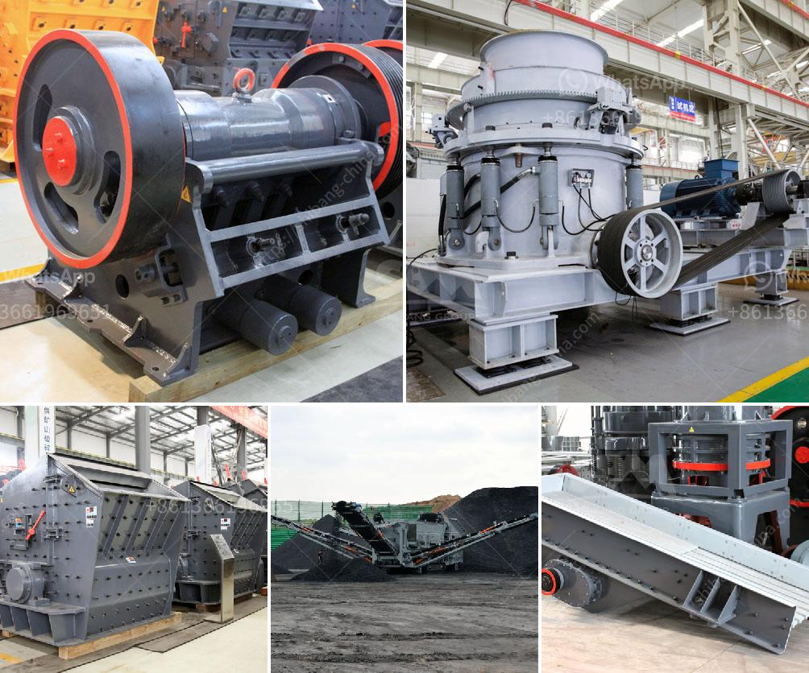

<h3>bentonite grinding machine manufacturer in india</h3>
Bentonite is a desirable industrial material used for a variety of purposes, including enhancing soil quality, foundry sand bonding, drilling mud, pet waste absorbent, and as a groundwater barrier. Being one of the leading manufacturers and suppliers of bentonite grinding machines in India, our Bentonite grinding machine manufacturer in India has earned a respectable position in the industry.

With the assistance of our qualified and experienced workforce, we are able to design and manufacture a wide range of Bentonite grinding machines that are widely used to grind various materials into fine powder. These machines are equipped with advanced technology and high-quality components, ensuring their durability and reliability.

One of the prominent features of our Bentonite grinding machine is its simple and user-friendly operation. The machine is designed to grind the material continuously, reducing labor efforts significantly. It also offers precise control over the grinding process, allowing users to obtain the desired particle size with ease.

Our Bentonite grinding machines are manufactured using superior-grade raw materials, sourced from trusted vendors in the industry. This ensures the durability and performance of the machines, even in harsh industrial environments. Additionally, our machines are designed to consume less power, resulting in energy savings and reduced operational costs.

As a Bentontie grinding machine manufacturer in India, we also offer customization services to meet the specific requirements of our clients. Our expert engineers work closely with the clients to understand their needs and develop machines that address their unique grinding challenges. Our machines are available in different capacities and configurations, allowing us to cater to a wide range of applications.

To ensure the quality of our Bentonite grinding machines, we have established a well-equipped quality control department. Our team of quality analysts rigorously tests each machine for various parameters, such as performance, reliability, and efficiency. This eliminates the possibility of any defects or shortcomings in our machines, ensuring their smooth and trouble-free operation.

Apart from manufacturing high-quality Bentonite grinding machines, we also offer timely after-sales support to our clients. Our team of skilled technicians is always ready to provide assistance, be it installation, maintenance, or repair services. We strive to build long-term relationships with our clients by providing them with excellent service and support.

In conclusion, our Bentonite grinding machine manufacturer in India offers technologically advanced and reliable machines that are widely used in various industries. With our commitment to quality and customer satisfaction, we have established ourselves as a trusted name in the industry. Whether it is for small-scale applications or large-scale industrial processes, our machines are designed to deliver exceptional performance. So, if you are looking for a high-quality Bentonite grinding machine, look no further! Contact us today and experience the excellence of our products and services.
<h3>Contact us</h3><ul><li><strong>Whatsapp:&nbsp;<a href="https://wa.me/8613661969651">+8613661969651</a></strong></li><li><a href="https://swt.shibang-china.com/?git&amp;zhl&amp;bentonite grinding machine manufacturer in india"><strong>Online Service(chat now)</strong></a></li></ul><h3>Related</h3><ul><li><a href='quarry crusher equipment for sale.md'>quarry crusher equipment for sale</a></li><li><a href='jaw crusher price list 150 x 200mm.md'>jaw crusher price list 150 x 200mm</a></li><li><a href='price of copper ore crushing machine.md'>price of copper ore crushing machine</a></li><li><a href='roller mill for ore.md'>roller mill for ore</a></li><li><a href='vibrating feeder zenith.md'>vibrating feeder zenith</a></li></ul>